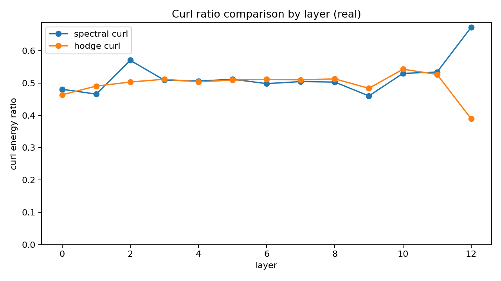
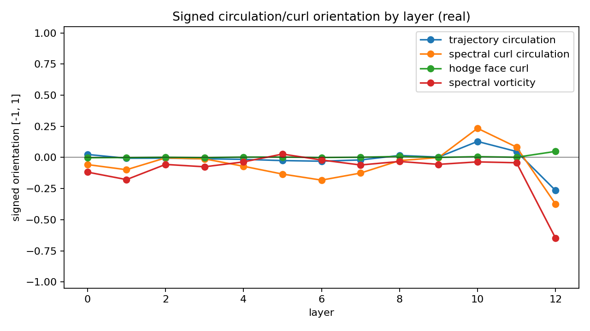
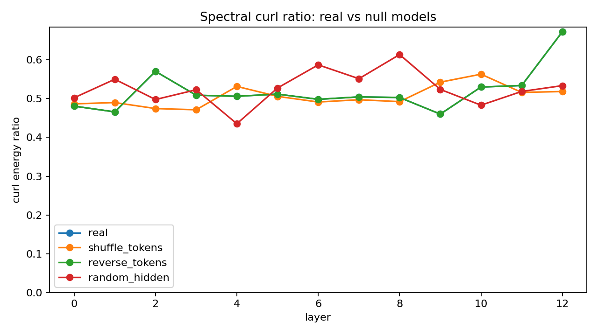
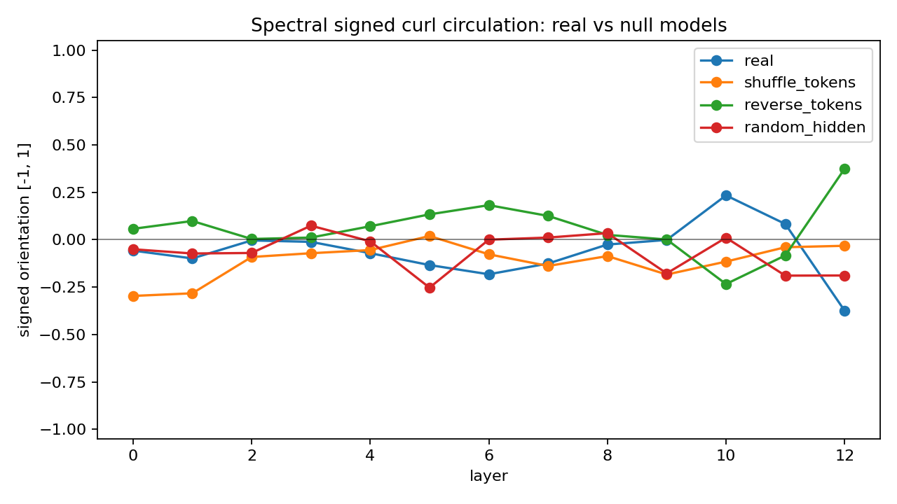
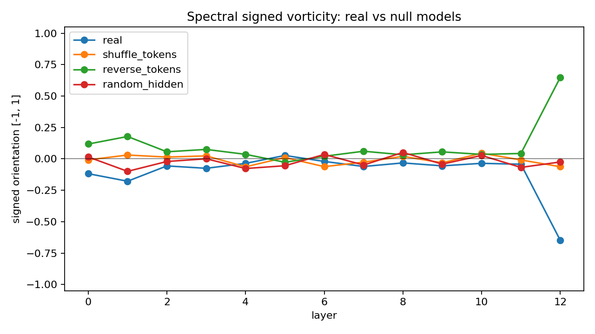

# Spiral Hodge

Fourier, graph, Hodge, and signed-circulation probes for transformer hidden-state trajectories.

Spiral Hodge is an experimental analysis script for asking a geometric question:

> If a language model's hidden states are projected into a low-dimensional semantic plane, does the token path behave like a field with gradients, curls, harmonics, and handedness?

The project is intentionally small and research-prototype shaped. It loads hidden states from a Hugging Face causal language model, reduces them into a 2D semantic coordinate system, treats token-to-token motion as a vector field, and exports layer-wise metrics and plots.

## What It Does

For an input text and a causal LM, `spiral_hodge.py` runs this pipeline:

1. Extract hidden states shaped `[layers, tokens, dim]`.
2. Reduce all layer-token hidden states into 2D coordinates with PCA or UMAP.
3. Build a token trajectory vector field from midpoint samples and token-to-token displacements.
4. Compute a nonuniform vector Fourier spectrum.
5. Project Fourier coefficients into Helmholtz-like gradient, curl, and harmonic components.
6. Build a graph Fourier spectrum over sampled trajectory points.
7. Build a Delaunay complex over token coordinates and run a discrete Hodge decomposition over edge flows.
8. Optionally run Hodge-Latent Traversal Dynamics (HLTD): a kNN graph Hodge decomposition over PCA/UMAP token-step node vectors.
9. Compute signed circulation and signed curl metrics, so reversed token order can be distinguished from the original direction.
10. Split spectral curl into low/mid/high frequency bands to separate coherent transport from high-frequency rotational clutter.
11. Add Hodge-independent vortex proxies: intrinsic trajectory turning and local Jacobian vorticity.
12. Export CSV metrics and diagnostic plots across every layer and optional null models.

## Hodge-Latent Traversal Dynamics

HLTD treats token generation as a sampled vector field on a hidden-state chart.
For each layer, token-step vectors are projected onto a kNN graph as scalar
edge flow, then decomposed into:

```text
exact      -> presence / gradient / source-sink dynamics
coexact    -> local semantic circulation over 3-cliques
harmonic   -> candidate global concept-loop component
flow       -> coexact + harmonic
```

This is intentionally separate from the older 2D Delaunay Hodge metric.
The Delaunay metric is a compact local-curl diagnostic for projected token
paths. HLTD can run on higher-dimensional charts, such as PCA-32, and logs
`hltd_exact_ratio`, `hltd_coexact_ratio`, `hltd_harmonic_ratio`, and
`hltd_semantic_flow_ratio`.

Example:

```bash
python3 spiral_hodge.py \
  --synthetic \
  --all-layers \
  --components 8 \
  --hltd \
  --hltd-k 12 \
  --hltd-vector-mode centered \
  --null-models all \
  --output-dir spiral_out_hltd \
  --csv-output layer_metrics.csv \
  --save-plots
```

For model runs, start with PCA rather than UMAP for decomposition:

```bash
python3 spiral_hodge.py \
  --model-path ./model/gpt2 \
  --text "The map drank the road and called it home." \
  --all-layers \
  --components 32 \
  --hltd \
  --hltd-k 16 \
  --hltd-vector-mode centered \
  --fourier-backend direct \
  --output-dir spiral_out_hltd_gpt2
```

The safest interpretation is comparative: look for layer/prompt regions where
HLTD non-exact energy beats matched nulls while fluency or downstream semantic
probes remain stable. Harmonic energy is topology-sensitive, so treat it as a
candidate global loop signal until it survives k-neighbor and bootstrap checks.

Use `--hltd-vector-mode centered` for reversal-sensitive experiments. The
original `forward` mode anchors each vector at `z_t`; centered mode anchors
`(z_{t+1} - z_{t-1}) / 2` at `z_t`, so real and reversed trajectories share the
same interior node set before edge-flow projection.

### Prompt-family HLTD suite

The repository includes a small prompt suite for comparing literal, metaphor,
identity-stress, and ontology-collapse text families:

```bash
python3 scripts/run_hltd_prompt_suite.py \
  --suite data/hltd_prompt_suite.jsonl \
  --model-path /Users/ryospiralarchitect/SpiralReality/model/gpt2 \
  --output-root spiral_out_hltd_suite \
  --k 16 \
  --components 32 \
  --max-length 128 \
  --null-models all

python3 scripts/summarize_hltd_suite.py \
  --run-root spiral_out_hltd_suite \
  --output spiral_out_hltd_suite/summary.csv
```

For k-sweeps, pass multiple `--k` values:

```bash
python3 scripts/run_hltd_prompt_suite.py \
  --suite data/hltd_prompt_suite.jsonl \
  --model-path /Users/ryospiralarchitect/SpiralReality/model/gpt2 \
  --output-root spiral_out_hltd_ksweep \
  --k 12 16 24 \
  --components 32 \
  --max-length 128 \
  --null-models all \
  --hltd-same-graph-reverse

python3 scripts/summarize_hltd_suite.py \
  --run-root spiral_out_hltd_ksweep \
  --output spiral_out_hltd_ksweep/summary.csv
```

The output root is ignored by git because per-prompt reports and plots can grow
quickly. The summary script reads each `layer_metrics.csv` and now emits:

```text
summary.csv              # one row per prompt/k/topology run
summary_family_k.csv     # family x k aggregate table
summary_layer.csv        # layer-wise aggregate curves and real-minus-null deltas
summary_prompt.csv       # prompt-level means across k
summary_bootstrap.csv    # prompt-level bootstrap confidence intervals
summary_family_gaps.csv  # pairwise family-gap bootstrap intervals
summary_report.md        # compact Markdown report for research notes
```

For triangle/topology ablations, keep run directories distinct:

```bash
python3 scripts/run_hltd_prompt_suite.py \
  --suite data/hltd_prompt_suite.jsonl \
  --model-path /Users/ryospiralarchitect/SpiralReality/model/gpt2 \
  --output-root spiral_out_hltd_topology \
  --k 12 16 24 \
  --components 32 \
  --max-length 128 \
  --null-models all \
  --no-hltd-triangles
```

`--no-hltd-triangles` automatically appends `__no_triangles` to each run
directory, and the summarizer records that suffix as a `topology` column.

Use `--hltd-same-graph-reverse` for the reversal-invariance gate. It fixes the
real trajectory's kNN graph and triangle complex, reverses only the node vector
field, and writes `hltd_same_graph_reverse_*` diagnostics. The usual
`reverse_tokens` null still rebuilds the chart/graph, so comparing both gaps
helps separate graph-construction jitter from true Hodge decomposition issues.

## Why Signed Curl Matters

The first version of this experiment measured curl energy ratios. Those ratios are useful, but they are unsigned: reversing a trajectory can preserve the same amount of curl energy.

That means:

```text
real token order    -> curl ratio = 0.6725
reversed token order -> curl ratio = 0.6725
```

The signed metrics add orientation. They measure whether the projected motion has a preferred clockwise/counterclockwise handedness in the semantic plane.

For the included GPT-2 example, the final layer behaves like this:

```text
real layer 12
trajectory_signed_circulation_alignment = -0.2652
spectral_signed_curl_alignment          = -0.3743
spectral_signed_vorticity_ratio         = -0.6479

reversed layer 12
trajectory_signed_circulation_alignment = +0.2652
spectral_signed_curl_alignment          = +0.3743
spectral_signed_vorticity_ratio         = +0.6479
```

That sign flip is the point: the unsigned energy says "there is curl-like structure"; the signed metrics say "the structure has a direction."

## Current Research Reading

The first live JAX run shifted the working hypothesis. The early intuition was:

> meaning formation creates vortex-like structure.

The more useful version now looks like:

> coherent autoregressive representation may suppress high-frequency rotational disorder while preserving or reorganizing larger-scale transport.

In the short GPT-2 prompt:

```text
The serpent coils not around the tree, but around cognition.
```

the `reverse_tokens` baseline behaves exactly as a signed-orientation sanity check should: unsigned energy stays the same, while signed trajectory, spectral curl, spectral vorticity, Hodge curl, and local Jacobian vorticity flip sign.

The stronger separation is not in total spectral curl. It is in smoothness and local rotational clutter:

```text
graph_high_freq_ratio mean
real:          0.4063
shuffle:       0.7703
random_hidden: 0.6968

hodge_curl_ratio mean
real:          0.1109
shuffle:       0.4928
random_hidden: 0.2647
```

This suggests that `graph_*` and `hodge_*` are currently better detectors of local disorder, while `spectral_*` may be closer to a mixture of global transport and generic curl induced by projection. The research question is therefore not just "is there a vortex?" but:

> which scales of rotational structure are suppressed, preserved, or amplified across layers and null models?

See [docs/research_notes.md](docs/research_notes.md) for the fuller interpretation, caveats, and next experiments.
See [docs/hltd_prompt_family_observations.md](docs/hltd_prompt_family_observations.md)
for the first 20-prompt HLTD family sweep.

## Repository Layout

```text
.
├── spiral_hodge.py                  # CLI and analysis implementation
├── spiral_hodge_report.py           # static interactive HTML report generator
├── data/hltd_prompt_suite.jsonl      # prompt-family suite for HLTD sweeps
├── scripts/                          # prompt-suite run and summary helpers
├── docs/research_notes.md            # current hypotheses and live-run interpretation
├── docs/hltd_prompt_family_observations.md
├── tests/test_spiral_hodge.py        # path resolution and signed-orientation tests
├── examples/izumi-gpt2/              # sample CSV and plots from a GPT-2 run
├── requirements.txt
├── pyproject.toml
└── LICENSE
```

## Installation

Create and activate a virtual environment if you want to keep dependencies local:

```bash
python3 -m venv .venv
source .venv/bin/activate
pip install -U pip
pip install -e .
```

Or install directly from `requirements.txt`:

```bash
pip install -r requirements.txt
```

Optional dependencies:

```bash
pip install finufft      # optional faster native Fourier backend
pip install jax          # optional JAX/XLA direct Fourier backend
pip install umap-learn   # optional UMAP reducer
```

The default Fourier backend is `direct`, which avoids native FINUFFT crashes and is safer for small to medium token sequences. Use `--fourier-backend jax` to run the direct nonuniform Fourier and signed-curl evaluation kernels through JAX/XLA when JAX is installed.

## Quick Start Without a Model

Run the synthetic smoke example:

```bash
python3 spiral_hodge.py \
  --synthetic \
  --all-layers \
  --null-models all \
  --fourier-backend direct \
  --fourier-modes 16 \
  --output-dir spiral_out_synthetic \
  --csv-output layer_metrics.csv \
  --save-plots
```

This creates:

```text
spiral_out_synthetic/layer_metrics.csv
spiral_out_synthetic/null_model_curl_spectral.png
spiral_out_synthetic/null_model_signed_spectral_curl.png
...
```

Generate a static HTML report from the CSV:

```bash
python3 spiral_hodge_report.py \
  --run-dir spiral_out_synthetic \
  --output report.html
```

## Running With a Local Hugging Face Model

If your model is available as a local Hugging Face directory:

```bash
python3 spiral_hodge.py \
  --model-path ./model/gpt2 \
  --text "The serpent coils not around the tree, but around cognition." \
  --all-layers \
  --null-models all \
  --fourier-backend direct \
  --fourier-modes 32 \
  --output-dir spiral_out \
  --csv-output layer_metrics.csv \
  --save-plots
```

`--model-path` implies local-only loading. You can also use:

```bash
python3 spiral_hodge.py --model ./model/gpt2 ...
```

For long text files, GPT-2 is normally limited to 1024 tokens, so use `--max-length 1024`:

```bash
python3 spiral_hodge.py \
  --model-path ./model/gpt2 \
  --text-file ./data/my_text.txt \
  --max-length 1024 \
  --all-layers \
  --null-models all \
  --fourier-backend direct \
  --fourier-modes 32 \
  --output-dir spiral_out_long \
  --csv-output layer_metrics.csv \
  --save-plots
```

## Offline Mode

Spiral Hodge supports offline/local model loading. Use a local model path:

```bash
python3 spiral_hodge.py --model-path ./model/gpt2 --local-files-only --text "..."
```

The script also respects Hugging Face offline environment variables:

```bash
export HF_HUB_OFFLINE=1
export TRANSFORMERS_OFFLINE=1
```

If a local model cannot be found, the CLI reports a short actionable error instead of a long Transformers traceback.

## Null Models

`--null-models` controls comparison baselines:

```text
real
shuffle_tokens
reverse_tokens
random_hidden
all
```

The controls are intentionally simple:

- `real`: unchanged hidden states.
- `shuffle_tokens`: same hidden vectors, but token order is randomly permuted.
- `reverse_tokens`: same path traversed backwards.
- `random_hidden`: Gaussian hidden states with matched per-dimension mean and standard deviation.

The `reverse_tokens` baseline is especially important for signed metrics. Unsigned curl energy should often stay similar, while signed circulation should flip.

## Main CSV Metrics

The generated `layer_metrics.csv` contains one row per variant and layer.

Important column groups:

- `spectral_*`: Fourier-domain Helmholtz energy totals and ratios.
- `spectral_curl_low_*`, `spectral_curl_mid_*`, `spectral_curl_high_*`: Fourier curl split into radial frequency bands.
- `hodge_*`: discrete Hodge energy totals and ratios over triangulated edge flows.
- `graph_*`: graph Fourier low/high frequency summaries.
- `trajectory_signed_*`: signed circulation of the raw token trajectory.
- `turning_*`: intrinsic path-turning angles between consecutive token-step vectors.
- `local_*`: local affine-Jacobian vorticity estimates that do not use Hodge or Fourier.
- `spectral_signed_*`: signed circulation and vorticity of the Fourier curl component.
- `hodge_signed_*`: signed face-circulation metrics from the discrete Hodge curl component.

The most immediately useful signed columns are:

```text
trajectory_signed_circulation_alignment
turning_alignment
spectral_signed_curl_alignment
local_signed_vorticity_ratio
spectral_signed_vorticity_ratio
hodge_signed_curl_alignment
```

These values are normalized to a rough `[-1, 1]` orientation scale:

- near `0`: weak or mixed orientation
- positive: one handedness
- negative: opposite handedness
- sign flip under `reverse_tokens`: expected and useful

## Example: GPT-2 Layer-12 Signed Curl

The `examples/izumi-gpt2/` folder contains a reference output from a local GPT-2 run over 1024 tokens.

### Curl Energy Ratio



The real run has a final-layer spectral curl-energy spike:

```text
spectral curl peak: layer=12, ratio=0.6725
hodge curl peak:    layer=10, ratio=0.5427
```

This suggests that the final-layer spectral field has a strong curl-like component, while the local Delaunay Hodge view peaks earlier.

### Signed Orientation



The signed metrics show that the final-layer curl spike is not merely large; it is oriented:

```text
real layer 12
trajectory_signed_circulation_alignment = -0.2652
spectral_signed_curl_alignment          = -0.3743
spectral_signed_vorticity_ratio         = -0.6479
hodge_signed_curl_alignment             = +0.0484
```

### Null Model Comparison







In this run, `reverse_tokens` mirrors the real signed orientation, while `shuffle_tokens` and `random_hidden` do not reproduce the final-layer signed vorticity spike with the same strength.

## CLI Reference

Common options:

```text
--model MODEL                 Hugging Face model name or local directory
--model-path PATH             local Hugging Face model directory
--text TEXT                   inline text
--text-file PATH              read text from a file
--max-length N                tokenizer truncation length
--all-layers                  run every layer
--layer N                     single-layer mode
--null-models LIST            real, shuffle_tokens, reverse_tokens, random_hidden, all
--reducer pca|umap            semantic coordinate reducer
--fourier-backend direct|finufft|jax
--fourier-modes N
--graph-eigs N
--k-neighbors N
--local-files-only            disable Hugging Face downloads/lookups
--save-plots                  write PNG diagnostics
--quiet                       reduce progress logs
```

## Development

Run tests:

```bash
python3 -m unittest discover
```

Run a quick syntax check:

```bash
python3 -m py_compile spiral_hodge.py
```

The tests include explicit reversal checks for signed orientation. A reversed trajectory should invert the signed circulation and signed spectral curl metrics.

## Caveats

This is a research probe, not a settled interpretation framework.

Important limitations:

- PCA and UMAP projections can introduce artifacts.
- Curl in a reduced semantic plane is not the same as curl in the full hidden-state space.
- Delaunay triangulations can be sensitive to degenerate or clustered projected points.
- Energy ratios near `0.5` require null-model comparison before interpretation.
- Signed orientation is meaningful primarily in comparative settings: real vs reverse, real vs shuffle, layer vs layer, or model vs model.

The safest reading is not "the model literally thinks in spirals." The safer claim is:

> Under this projection and decomposition, some layers produce vector-field structure with measurable curl energy and signed handedness that can be compared against simple controls.

That is already interesting enough.

## Interactive HTML Report

`spiral_hodge_report.py` turns an existing `layer_metrics.csv` into a standalone
HTML dashboard. It does not rerun the model and it does not require a web server.

```bash
python3 spiral_hodge_report.py \
  --run-dir examples/izumi-gpt2 \
  --output report.html \
  --title "Izumi / GPT-2 Spiral Hodge Report"
```

The report includes:

- selected-variant curl energy charts
- selected-variant signed orientation charts
- real vs null-model comparison for any key metric
- peak layer summaries
- reverse-direction cancellation diagnostics
- a sortable-by-eye layer table for the most useful metrics

The committed example report is here:

[examples/izumi-gpt2/report.html](examples/izumi-gpt2/report.html)
