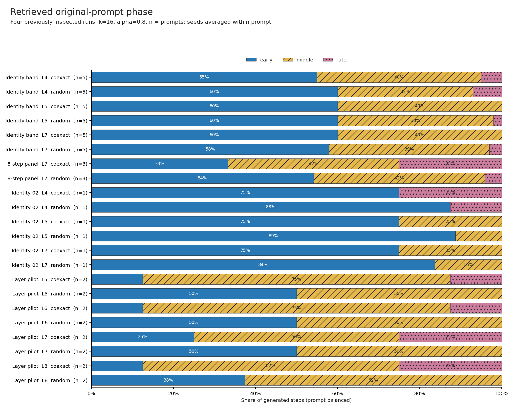
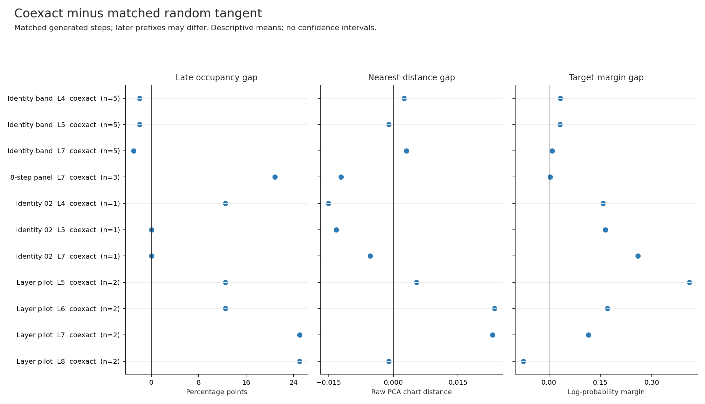

# Closed-Loop Phase Occupancy Audit

## Question and Scope

Does closed-loop coexact steering retrieve late original-prompt nodes more
often, and does that account for its uneven semantic readouts?

This is a retrospective descriptive audit of 31 saved run directories, with
32,238 step rows covering 16 distinct family/prompt IDs. Verifying and
collapsing deterministic seed copies leaves 8,444 rows. These are not 8,444
independent observations: prompts, generation steps, parameter sweeps, and
scorer-only reruns recur across the sources. Every source remains separate.
No additional model inference was used.

The full audit includes 50 figures, seven CSV tables, a generated report,
and a manifest binding the exact source CSV/manifest bytes to the outputs.
Compact condition summaries, prompt-level random gaps, and overview figures
are included under `docs/data/hltd_closed_loop_phase/` and `docs/figures/`.

## Measurement Contract

The current runner builds its field from the original prompt and queries the
nearest field node for the newest token at each generated step. Its centered
step=1 field contains prompt tokens 1 through T-2. Therefore:

```text
node_token_index = node_index + 1
position_frac = node_token_index / (prompt_len - 1)
early:  [0, 1/3)
middle: [1/3, 2/3)
late:   [2/3, 1]
```

This is the position of the retrieved original-prompt node, not the position
of the newly generated token. The fractions use the same coordinates and
third boundaries as the signed position note. A 12-bin index is also retained
in the annotated step table.

All 31 historical manifests lack an explicit field contract. Their positions
are recovered under the documented centered step=1 runner convention, marked
`recovered_centered_step1`. Historical normalization, ridge, and other omitted
settings are not reconstructed as if they were recorded. New runs write
`node_token_index`, `position_frac`, and the field contract directly. The
analyzer verifies explicit coordinates against the centered mapping.

Before creating output, the audit checks numeric validity, prefix lengths,
manifest arm/seed/layer/k coverage, contiguous steps, and complete generation
lengths or recorded EOS termination. Deterministic copies must agree in every
recorded field except seed. Conflicting copies fail the audit.

Means first balance steps within a seed, then seeds within a prompt, then
prompts within source/family/layer/k/alpha/target-set condition. Occupancy
includes inactive visits. Response means use active visits; unvisited and
inactive phases retain missing estimates and explicit coverage counts.
Within a phase, response means average the seeds that visit that phase,
then the prompts that have an estimate. These phase means do not in general
recombine into the overall mean by multiplying pooled occupancy weights.

Random comparisons match source, prompt, layer, k, target set, alpha, seed,
and generated step. Their prefixes may already differ after earlier
interventions. Fourteen of 410 condition-level branch comparisons have no
random arm in their source; their gaps remain missing. Response gaps also
require both arms to be active. Confidence intervals are not estimated here.

## Observations

The overview fixes k=16 and alpha=0.8 within four run collections inspected
before this audit: the layer pilot, 8-step branch panel, identity_02 surface,
and completed identity band. Per-source figures cover every condition and
component, including the remaining runs.



At L7, the following rows illustrate why a single late-occupancy explanation
is insufficient. Target gaps are branch-minus-random changes in the lexical
target-control log-probability margin. They are descriptive estimates.

| Source | Prompts | Random seeds | Coexact early/middle/late | Random early/middle/late | Target gap |
| --- | ---: | ---: | --- | --- | ---: |
| 8-step ontology branch panel | 3 | 1 | 33.3 / 41.7 / 25.0% | 54.2 / 41.7 / 4.2% | +0.00309 |
| Completed identity band | 5 | 5 | 60.0 / 40.0 / 0.0% | 58.0 / 39.0 / 3.0% | +0.00905 |
| Identity_02 surface, k16/a0.8 | 1 | 20 | 75.0 / 25.0 / 0.0% | 83.8 / 16.2 / 0.0% | +0.26013 |
| Five-prompt ontology run | 5 | 1 | 40.0 / 45.0 / 15.0% | 55.0 / 45.0 / 0.0% | +0.00387 |
| Five-prompt identity run | 5 | 1 | 60.0 / 40.0 / 0.0% | 55.0 / 40.0 / 5.0% | +0.15489 |

The identity_02 surface row above fixes k and alpha; the previous preliminary
75-83% early description averaged over its k/alpha sweep. Those are different
summaries of the same run, not a change in the raw data.

The 8-step panel has a +20.83 percentage-point late gap, yet almost no mean
target-margin advantage. Its coexact nearest-distance gap is -0.01215 in raw
PCA chart units, so greater late occupancy does not even imply greater
nearest-node distance in this sample. The selected token's base-model
log-probability gap is -0.28479; this diagnostic alone does not establish a
fluency effect.

In the completed five-prompt identity band at L7, coexact occupies early/middle
nodes throughout all four steps. Its lexical target gap is small despite this
early coverage. Identity_02 has a much larger target gap with similarly early
occupancy, but represents only one prompt. The five-prompt identity source
also differs from the band in null-seed coverage and historical configuration
provenance, so these sources are not interchangeable replications.



Step maps show that the 8-step panel starts with the same retrieval distribution
for coexact and random, then their trajectories diverge. Its coexact raw
nearest distance changes from a prompt mean of 0.21641 at step 0 to 0.46168 at
step 7. A local distance scale and an off-chart reconstruction residual would
be needed to interpret this as departure from the sampled manifold.

The original and prompt-heldout identity_02 scorers have identical position
and distance rows at the same settings, while their target scores differ.
They remain distinct source entries and are not treated as extra geometric
evidence.

## Interpretation and Next Gate

The audit supports measuring retrieval phase as part of the closed-loop
workflow. It does not identify phase as a causal mediator or justify a
phase-adjusted treatment estimate: the retrieved phase can itself be changed
by earlier interventions. Conditioning on it selects different histories.

There are also three gaps between this audit and the original HLTD hypothesis:

1. The historical closed-loop runner uses the ridge/clique decomposition,
   whereas the recent signed gate uses an orthogonal matched-Betti complex.
   A bridge experiment must align those contracts.
2. Nearest distance is an uncalibrated distance inside a projected chart.
   It does not measure all hidden-state distance or establish manifold adherence.
3. Lexical target margins and selected-token logprob gains do not measure
   learned identity/affordance drift or independently establish preserved fluency.

The next bounded step remains the signed L7 position test. Freeze the existing
20-prompt, k16, matched-Betti 0.5, centered/PCA-32 contract with alphas
plus/minus 0.25, 0.5, 1.0 and eight random seeds. Specify early-third odd
next-token response as the primary endpoint before running; report the
early-minus-late contrast and even response as secondary outcomes. A confidence
interval containing zero for even response is not evidence of equivalence.

Using the same prompts tests layer generalization within the discovery sample;
it is not independent prompt replication. Treat L5 as discovery, test L7
under the frozen rule, and use L8 as a separately labeled extension if L7
supports the primary effect. Learned-probe and closed-loop semantic claims
still need prompt-disjoint evaluation and aligned decomposition settings.

## Reproduction

```bash
python3 scripts/summarize_hltd_closed_loop_phase.py \
  --scan-root . \
  --output-root spiral_out_hltd_closed_loop_phase_audit_v1 \
  --evidence-root docs
```

Use `--run-roots <directory> ...` to specify a frozen source set instead of
discovering every `spiral_out*/**/closed_loop_steps.csv`. Discovery intentionally
includes small smoke runs; source identity is retained in all tables.
`--no-plots` produces only analytical tables and a report. Source and output
SHA-256 values are in `phase_audit_manifest.json`; the compact export receipt
is `docs/figures/hltd_closed_loop_phase_manifest.json`.

To redraw existing tables without inference or re-aggregation:

```bash
python3 scripts/plot_hltd_closed_loop_phase.py \
  --summary-root spiral_out_hltd_closed_loop_phase_audit_v1
```

The overview uses stacked bars for phase composition and aligned dot plots for
random gaps. Per-source pages use phase bars and step/response heatmaps, with
gray for missing estimates. Labels, zero lines, phase hatches, and fixed
within-source color scales preserve the comparison when printed. All plots
are exported with Matplotlib; no remote assets are required.

## Validation

The completed audit passed all 152 repository tests. Focused tests cover
position boundaries, explicit/legacy coordinate agreement, missing manifest
arms/layers, missing steps, deterministic-copy conflicts, recorded EOS,
inactive phases, unequal trajectory lengths, matched-arm keys and norms, missing
random controls, preflight-before-write behavior, and evidence export integrity.

An independent standard-library calculation reproduced occupancy, nearest
distance, and active target margins for all 2,448 phase summary rows. A second
calculation reproduced the late-occupancy, distance, and target-margin random
gaps for all 410 conditions. The two identity_02 scorer variants agree on all
13,680 aligned raw geometry/token rows. Source, code, and generated artifact
hashes were verified; all 50 PNGs passed nonblank pixel checks, and the
overview and representative per-source pages were visually inspected.

Python compilation, targeted Ruff checks (with the repository's executable
script import-bootstrap E402 pattern excluded), and `git diff --check` passed.
The existing unrelated CSV-reader ResourceWarnings remain in the test suite.
