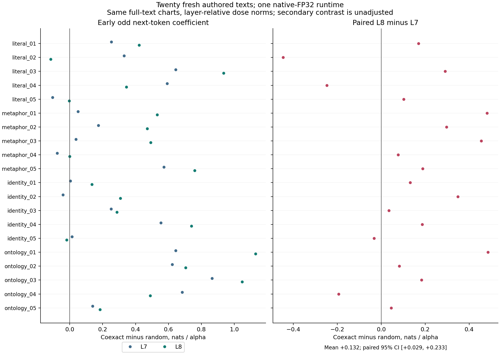
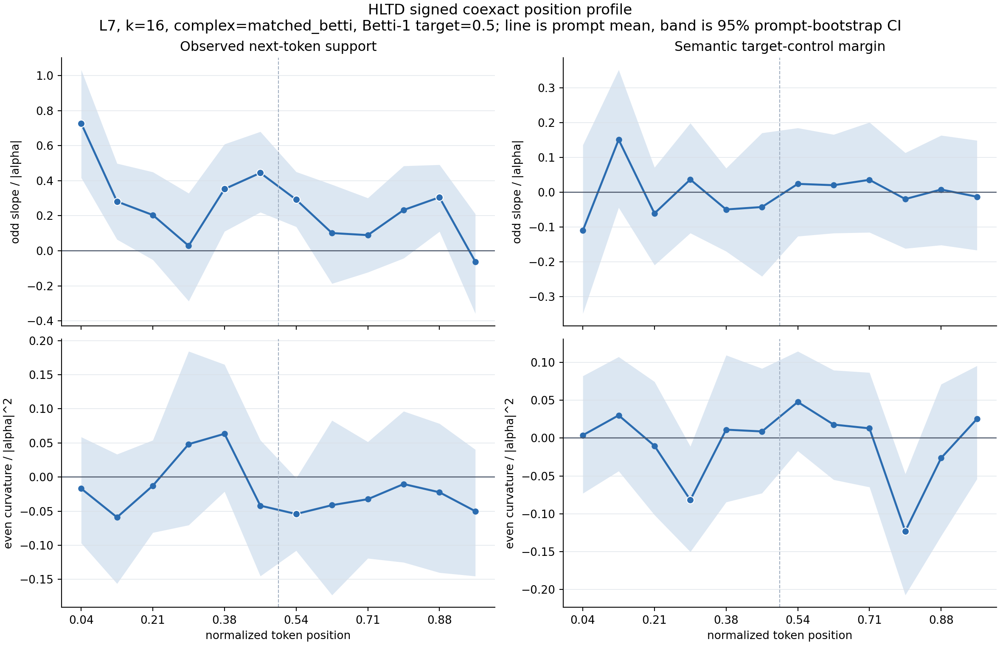
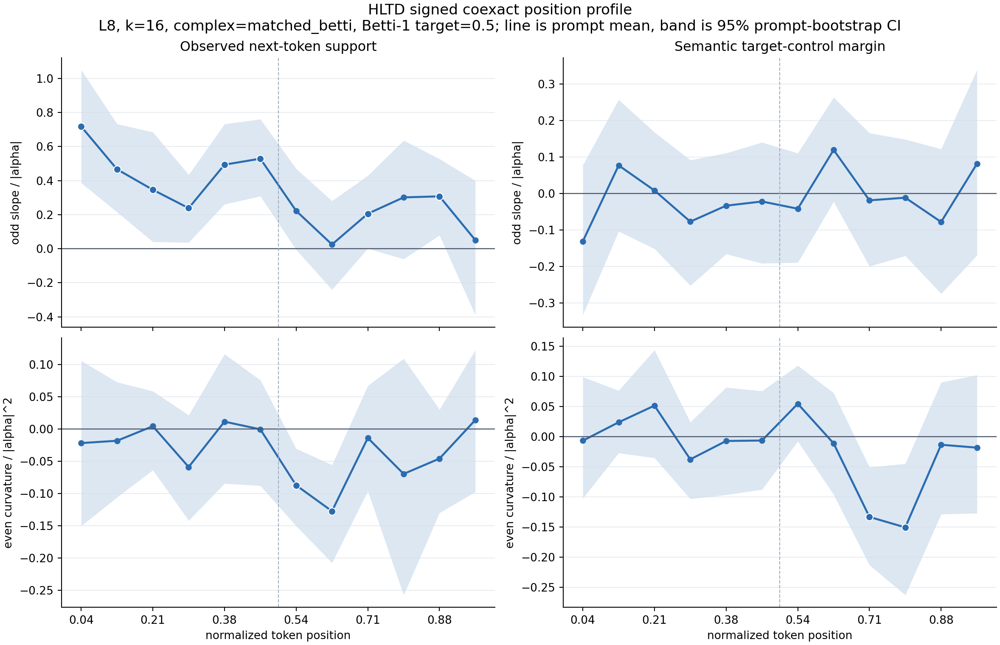

# Fresh-Text Native-FP32 L7/L8 Gate

## Question

The previous native-FP32 [L8 gate](hltd_signed_l8_position_gate.md) retained
the early signed next-token response on the same 20 texts used for L7.
This gate asks whether that fixed endpoint also holds for **20 newly authored
texts at both L7 and L8**, evaluated in one runtime and one model instance.

The result is new-text evidence within the same four authored families, not
a blind external sample, novel writing style, population replication, or proof
that the model never encountered similar language during training.

## Prospective Design

The [protocol](data/hltd_fresh_l7_l8/protocol.json) fixes every text, token ID,
numerical condition and inference rule before model activations or treatment
responses from these texts are inspected. The
[new suite](../data/hltd_fresh20_prompt_suite.jsonl) has five texts per family:
literal, metaphor, identity stress and ontology collapse.

| Condition | Frozen value |
| --- | --- |
| Model/runtime | One local GPT-2 small native-FP32 load, MPS SDPA |
| Layers | L7 then L8; no response summaries inspected between them |
| Geometry | Normalized PCA-32, k16, centered field, orthogonal matched-Betti 0.5 |
| Treatment | Coexact and random tangent; signed alpha +/-0.25, +/-0.5, +/-1 |
| Repetitions | Eight seeds, all 606 interior token positions |
| Raw size | 58,176 rows per layer, 116,352 total |
| Baseline | Matched unhooked batch-12 |
| Per-layer endpoint | All 80 early prompt/bin estimates; lower 95% bootstrap bound >0 |
| Bootstrap | Prompt unit, 5,000 draws, seed 1729; existing sorted-group estimator |
| Paired secondary | L8-minus-L7 early mean; 5,000 paired-prompt draws, seed 2718 |

Both layer endpoints must pass for
`BOTH_LAYERS_SUPPORTED_ON_FRESH_TEXTS`. A negative endpoint remains
`NOT_SUPPORTED_AT_BOTH_LAYERS`; any missing early bin produces
`INSUFFICIENT_COVERAGE`. Individual prompts need not all be positive. No
prompt replacement, imputation, bin reselection or response-based stopping
is allowed. Both layers are run regardless of response sign; only an input
or numerical-validity failure stops execution.

Actual model tensors must match native-F32 checkpoint bytes before and after
both layers. All captured forward activations/logits must be FP32; autocast
and device fallback are forbidden. Each layer's 606 zero-hook checks must
precede its nonzero treatments, with <=1e-4 logit error and exact baseline-row
equality. Saved unsteered hidden states and all PCA arrays must be byte-identical
between the two layer runs for every prompt.

## Novelty and Scope

The repository's three historical JSONL suites contain 49 entries. No new
text or ID duplicates them after case/whitespace normalization, and all 20
new texts are mutually unique. The largest historical word-trigram Jaccard
overlap is 0.053571; this is a descriptive audit, not a selection threshold.
The first-authored set is retained in full; no alternatives were chosen using
model responses. Tokenization alone was checked before freeze: 31-34 tokens
per text, without truncation.

The families and their generative conventions remain shared with earlier work.
Exact text novelty does not establish stylistic or conceptual independence.
The frozen author-created set is small and not randomly sampled from a defined
language population; the bootstrap does not remove this selection boundary.

The lexical target/control vocabularies remain unchanged from the old texts.
They are **legacy vocabulary-transfer diagnostics**, not new-text semantic
ground truth or objectives. Changing those lists after observing responses
would be a different experiment.

## Results

The [joint verdict](data/hltd_fresh_l7_l8/gate_verdict.json) is
**`BOTH_LAYERS_SUPPORTED_ON_FRESH_TEXTS`**. Both primary endpoints have
complete early coverage and a positive lower bootstrap bound.

| Layer | Early odd next-token coefficient | 95% prompt-bootstrap CI | Positive prompts | Early prompt/bins | Active interior positions |
| --- | ---: | --- | ---: | ---: | ---: |
| L7 | +0.310256 | [+0.177039, +0.439848] | 17/20 | 80/80 | 568/606 |
| L8 | +0.442290 | [+0.285337, +0.595512] | 16/20 | 80/80 | 565/606 |

These are finite signed response coefficients of **coexact minus matched
random tangent**, in nats per alpha, fitted over the three fixed magnitudes.
They are not infinitesimal derivatives or absolute improvements over
unsteered generation. All 116,352 treatment rows, including inactive
components, are retained. The estimator uses the frozen activity filter;
no response-sign exclusion or imputation was added.

The positive mean response repeats on new text strings, but the earlier
**all-prompts-positive** observation does not. The retained L7 negatives are
`fresh_literal_05`, `fresh_metaphor_04` and `fresh_identity_02`. L8 negatives
are `fresh_literal_02`, `fresh_literal_05`, `fresh_metaphor_04` and
`fresh_identity_05`; the metaphor example is nearly zero (-0.000039).
This is a repeatable sample-average endpoint, not uniform per-text efficacy.

### Paired Layer Contrast

The prespecified secondary early L8-minus-L7 mean is **+0.132034**, with
paired-prompt 95% CI **[+0.029279, +0.232759]**; 16/20 prompt differences are
positive. The [paired table](data/hltd_fresh_l7_l8/early_paired_comparison.csv)
retains all negative layer differences as well.



Two qualifications prevent interpreting this as a pure layer effect. The
L8/L7 [natural-step norm ratio](data/hltd_fresh_l7_l8/dose_scale_comparison.csv)
is **1.129118 at the median**, with range [1.103464, 1.162522]. In addition,
the [activity masks](data/hltd_fresh_l7_l8/activity_comparison.csv) disagree
at **25/606** positions: 554 are active in both, 14 only in L7 and 11 only
in L8. Even complete prompt/bin coverage does not mean identical within-bin
token support. Same-runtime and same-chart controls remove those particular
differences, not dose, direction or activity-support differences.

### Semantic and Position Diagnostics

| Secondary early coefficient | L7 mean [95% CI] | L8 mean [95% CI] |
| --- | --- | --- |
| Legacy lexical semantic margin, odd | +0.003870 [-0.090680, +0.097842] | -0.030661 [-0.099650, +0.038256] |
| Next-token response, even | -0.010086 [-0.054497, +0.042653] | -0.023711 [-0.068501, +0.018053] |

All four intervals include zero. The next-token endpoint repeats without
establishing lexical-semantic alignment; the old vocabulary is not ground
truth for these new texts. A null-crossing interval is not proof of zero
semantic effect or equivalence.





Odd next-token phase means remain positive in early, middle and late thirds
at both layers. The early-minus-late interval is positive for L7
(+0.161952 [0.007974, 0.321866]) but crosses zero for L8
(+0.213084 [-0.009295, 0.449380]). Thus a positive early endpoint does not
establish an early-specific advantage at both layers. All phase and position
intervals are secondary and unadjusted. Late-bin coverage is lower: L7 bin
11 has 19 prompts; L8 bins 9 and 11 have 19 and 18. Other bins have all 20.

## Verification

The protocol was frozen at **2026-09-27 01:00:31 UTC**, execution started at
01:00:58 and both layers completed at 01:19:02. No response summary was read
between layers. There was one model load and no retry. All **42 frozen input
receipts** still match, including the numerical implementation and prompt
texts. The 148 native-FP32 parameter tensors (124,439,808 parameters) match
source bytes before and after the complete run.

All **1,212** layer/position zero-hook checks have zero error against
matched-batch logits and zero baseline-row spread. Single-example versus
batch-12 offsets remain: maximum logit difference **0.000938416**, and
maximum absolute next-token log-probability offset **0.000065145**. Matched
baselines remain necessary even with native FP32. All 20 saved hidden/PCA
array sets are byte-identical between layers.

The [independent standard-library audit](data/hltd_fresh_l7_l8/stdlib_raw_audit.json),
also executed with `python3 -S`, reconstructs **956 L7 + 948 L8 = 1,904**
coefficients directly from steered probabilities; maximum error is
**2.50e-16**. Artifact tests independently reconstruct all **32** phase
bootstrap summaries and the paired interval, and verify the joint decision,
source receipts, exact zero-control grids and chronology.

The [manifest](figures/hltd_fresh_l7_l8_manifest.json) binds 33 compact data
files, three visually inspected/nonblank figures, verification code and
183 local source artifacts. Raw CSVs, field arrays and launch logs remain
local under the ignored run directory. Numerical measurements are not a
throughput benchmark; supporting regression tests briefly used JAX/Metal
while L8 was running, so there is no exclusive-device timing claim.

After both layer runs and artifact export, the complete suite passes
**205 tests** (194 subtests); the only warning is the existing deprecated
`TRANSFORMERS_CACHE` variable. Targeted Ruff checks (excluding the existing
E402 import-path convention), Python compilation and `git diff --check`
pass. The preceding L8 continuation's 98 frozen receipts also remain intact.

## Interpretation Boundary

These are teacher-forced, full-text fields. PCA uses all layers and positions,
and centered increments include future tokens. An activation intervention is
causal within the evaluated forward pass, but its direction is not necessarily
available from the prefix during online generation. Successful next-token
response on new texts would not resolve that availability issue.

Even within one runtime, the L7/L8 paired contrast compares each layer's own
reconstructed direction and **natural hidden-step norm**. It does not hold the
absolute perturbation magnitude fixed. No common-norm arm is included in this
gate. Position, phase, lexical-margin and paired intervals are secondary and
unadjusted; none replaces a failed primary endpoint.

No generated-text fluency, identity/affordance control, cross-model transfer,
or concept-ring result is established by this endpoint.

## Next Question

The next distinct question is **availability without future text**. A bounded
follow-up could freeze a chart/field on a separate training-text set and
estimate evaluation directions using only each observed prefix, retaining
matched random controls and treating fluency/semantic outcomes separately.
This needs a new prospective protocol and explicit non-overlap rules, not
retroactive relabeling of the present full-text field as online.

If the aim is instead to isolate L7/L8 differences, that requires a separate
common-norm comparison with a prespecified activity-support policy. No
prefix-only, common-norm or additional-generation experiment was run here.

## Reproduction

```bash
python3 scripts/run_hltd_fresh_gate.py \
  --protocol docs/data/hltd_fresh_l7_l8/protocol.json

python3 scripts/analyze_hltd_fresh_gate.py \
  --protocol docs/data/hltd_fresh_l7_l8/protocol.json
```

Existing output directories and analyses are rejected. Required frozen inputs
cannot be silently skipped. A new attempt needs its own prospective protocol
and output location; old records are never overwritten.
