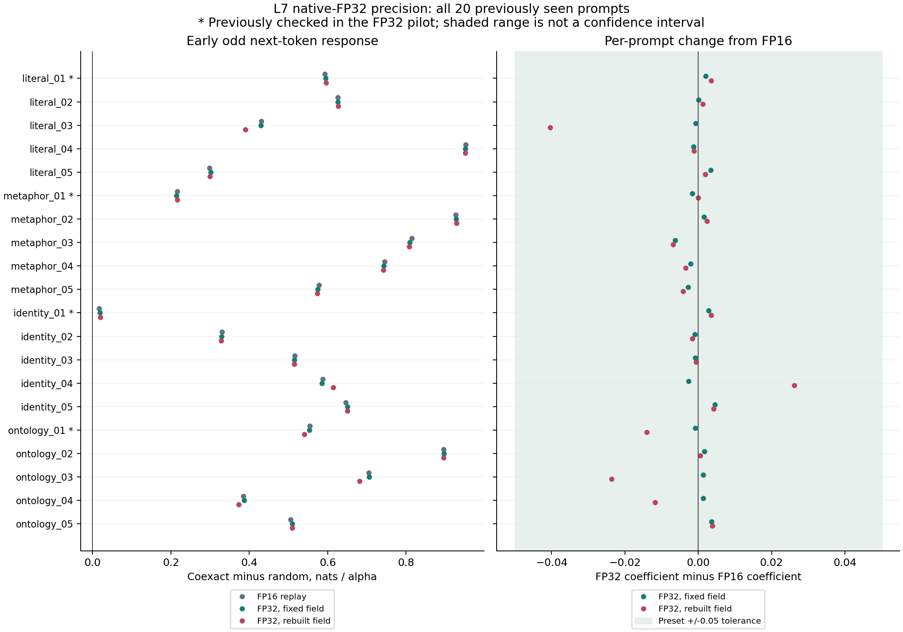
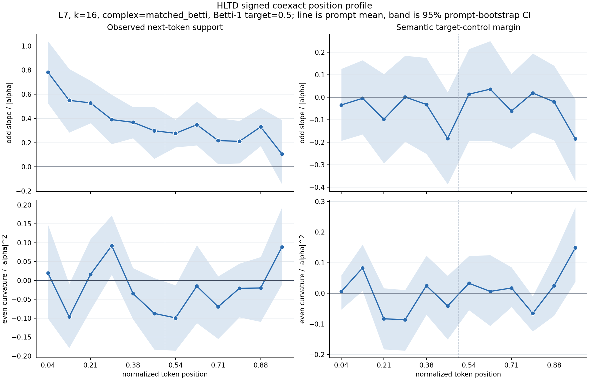

# Native-FP32 L7 Full-Suite Precision Gate

## Question and Scope

The [four-prompt precision pilot](hltd_precision_l7_gate.md) retained the L7
early odd next-token response in native FP32, with fixed and rebuilt fields.
This follow-up extends exactly that signed contract to all **20 previously
seen texts**, without selecting prompts or changing the 0.05 sensitivity bound.

All 20 FP16 results and four native-FP32 results were known before this gate.
The original four pilot prompts and the remaining sixteen are reported
separately. The remaining sixteen are newly checked at FP32, not held-out
texts or an independent prompt sample. No L8 treatment is included.

## Frozen Design

The [protocol](data/hltd_precision_l7_full/protocol.json) records the knowledge
boundary, all prompt token IDs, code and model hashes, the execution locations,
and the analysis rules before this full-suite treatment run.

| Condition | Value |
| --- | --- |
| Model | Local GPT-2 small; independent FP16 and native-FP32 checkpoint loads |
| Geometry | L7, k16, normalized PCA-32, centered field, orthogonal matched-Betti 0.5 |
| Treatment | Coexact and random tangent, alpha +/-0.25, +/-0.5, +/-1 |
| Replicates | Eight random seeds, all 564 interior token positions |
| Arms | FP16 replay, FP32 with fixed FP16 field, FP32 with rebuilt field |
| Size | 54,144 rows per arm; 162,432 total |
| Baseline | Unhooked batch-12, matched to the intervention batch |
| Estimator | Seed-matched coexact-minus-random gaps, signed odd/even coefficients |
| Primary region | Equal mean of all four early bins per prompt |

The frozen numerical runner and estimator are reused unchanged. A thin new
runner replaces only the load audit: it compares **the actual in-run model
tensors byte for byte** against native F32 values or their F32-to-F16 casts,
including signed zero, before calibration and interventions. This closes the
pilot's numerical-equality versus bytewise-check wording gap. An upcast of
FP16-rounded weights does not pass. Device fallback and autocast are forbidden.

FP16 replay must reproduce all historical steered probabilities and field
scalars within 1e-8. All positions must pass the matched-batch zero-hook check
(logit error <=0.0001) and exact identical baseline rows before nonzero doses.
Fixed-field FP32 must receive exactly the same sequence of nominal float32
intervention-vector bytes as replay. Failures stop the run and keep a receipt.

## Two Decisions

**Precision sensitivity:** all 80 early prompt/bin estimates must be available
in every arm. Every prompt's early coefficient must remain positive, and
both native-FP32 arms must differ from FP16 by at most **0.05 absolute** for
every prompt. Report `PRECISION_STABLE_ON_FULL_SUITE` only if all conditions
hold; otherwise preserve the missing estimates or failing prompts. The bound
is an engineering sensitivity threshold, not a population-equivalence margin.

**Early response support:** separately apply the earlier L7 rule to each arm:
complete early coverage and a positive lower bound of the 95% prompt-bootstrap
interval. Reuse 5,000 draws and seed 1729. A positive response can coexist with
precision sensitivity, so these decisions must not be collapsed into one claim.

Pilot4 versus remaining16 comparisons, full position profiles, even responses,
lexical semantic margins and activity changes are secondary descriptive
outputs. Do not count seeds or tokens as independent prompts. Do not tune a
threshold or remove a prompt after seeing its native-FP32 response.

## Results

The run completed on 2026-09-12 JST, with **162,432 rows** and no failed
execution stage. The frozen decision is
[`PRECISION_STABLE_ON_FULL_SUITE`](data/hltd_precision_l7_full/precision_verdict.json).
Both native-FP32 arms also pass the separate early-response support rule.

### Early Response and Precision

The means below equally weight all 20 prompts after averaging their four
early bins. Coefficients are coexact-minus-random odd next-token responses,
in nats per alpha. Intervals use the frozen prompt bootstrap, not token-level
or seed-level replication.

| Arm | Mean coefficient | 95% prompt-bootstrap interval | Positive prompts |
| --- | ---: | --- | ---: |
| FP16 replay | +0.565892 | [+0.460341, +0.667825] | 20/20 |
| FP32 fixed field | +0.566032 | [+0.460757, +0.667777] | 20/20 |
| FP32 rebuilt field | +0.562878 | [+0.457759, +0.665914] | 20/20 |

Every arm has complete **80/80 early prompt/bin** coverage. All three have
**528/564 active coexact token positions**, with no activity-mask changes.

The largest absolute per-prompt change is **0.006265** for fixed-field FP32
(`metaphor_03`) and **0.040344** for rebuilt-field FP32 (`literal_03`). Both
meet the preset 0.05 bound, but the latter is not negligible: `literal_03`
falls from +0.430369 to +0.390026, about 9.4%. The mean's stability must not
hide this individual sensitivity. No threshold was relaxed after seeing it.



Stars identify the four known-FP32 pilot texts. The shading is the engineering
tolerance, not a confidence interval. Exact per-prompt values are in the
[paired table](data/hltd_precision_l7_full/early_precision_comparison.csv).

### Pilot and Remaining Sixteen

| Subset | FP16 replay | FP32 fixed field | FP32 rebuilt field |
| --- | ---: | ---: | ---: |
| Previously checked pilot4 | +0.344820 | +0.345439 | +0.343054 |
| Newly FP32-checked remaining16 | +0.621160 | +0.621181 | +0.617835 |

All sixteen additional texts have positive early coefficients in every arm.
The result is therefore not carried solely by repeating the four pilot texts.
This subset distinction is about numerical validation history, not held-out
language or independent prompt sampling.

### Largest-Change Diagnostic

After the frozen decision, a
[post-hoc branch diagnostic](data/hltd_precision_l7_full/largest_change_diagnostic.json)
was run for `literal_03`, selected solely as the largest rebuilt-field change.
Its coexact branch's early odd coefficient changes from **+0.553056** to
**+0.514682**; the random branch changes from **+0.122687** to **+0.124656**.
Thus most of the -0.040344 contrast shift comes from the coexact response,
not just the random control.

The same prompt's fixed-field FP32 contrast is +0.429639, close to the FP16
+0.430369. Its cycle rank, triangle rank and triangle count remain 234, 117
and 401 across all arms, while the coexact energy ratio changes only from
0.613515 to 0.614051. Aggregate topology counts and energy ratios are therefore
not enough to claim invariant steering response. These counts do not prove
that individual edge/face memberships or reconstructed directions are identical.
The diagnostic does not identify which reconstruction step causes the change,
and it does not replace or retune the primary gate.

### Numerical Controls

| Maximum across 564 positions per dtype | FP16 | Native FP32 |
| --- | ---: | ---: |
| Zero hook versus matched-batch logits | 0 | 0 |
| Unhooked batch row spread | 0 | 0 |
| Single-example versus batch logits | 0.250000 | 0.000328064 |
| Absolute single/batch next-token log-probability offset | 0.102513 | 0.000043861 |

FP32 substantially reduces but does not eliminate cross-batch offsets.
Matched-batch controls remain necessary. All **1,128 position/dtype controls**
are retained in the [calibration receipt](data/hltd_precision_l7_full/zero_calibration.json).
All **4,512 nominal intervention batches** match byte for byte between FP16
replay and fixed-field FP32. The actual model loads pass bytewise source checks
for all 148 trainable tensors, 124,439,808 parameters per model.

### Semantic Boundary



This is the rebuilt-field native-FP32 arm on all 20 texts. Bands are
pointwise 95% prompt-bootstrap intervals, not simultaneous inference. Bins 10
and 11 each have 19 active prompts; every earlier bin has all 20. These late
coverage differences do not affect the fully covered early primary endpoint.

For the early region, the rebuilt-field semantic target-control odd coefficient
is **-0.034308**, interval **[-0.111148, +0.041939]**. The next-token even
coefficient is **+0.007689**, interval **[-0.036053, +0.050553]**. The numerical
precision check does not establish a positive early lexical-semantic effect or
a reliable even response. Identity/affordance control and preserved fluency
remain unestablished.

## Verification

The [independent raw audit](data/hltd_precision_l7_full/independent_raw_audit.json)
recomputes **952 coefficients per arm, 2,856 total**, directly from steered
log probabilities. All match the saved analysis within **4.45e-16**. A separate
FP16 replay check also matches the earlier full20 coefficients after changing
to matched-batch baselines, confirming cancellation of the shared offset in
the signed contrasts.

Artifact tests independently recompute all 48 arm/phase/metric/contrast
bootstrap summaries and the precision decision, including the pilot/remainder
split. The [manifest](figures/hltd_precision_l7_full_manifest.json) binds compact
evidence and the two visually inspected figures to raw runs, field caches,
intervention traces and durable launch logs. The original pilot and earlier
L7 records are preserved.
The full suite passes **184 tests**; targeted Ruff, compilation and
`git diff --check` also pass. All 31 frozen input receipts still match, as do
the earlier L7 and four-prompt pilot's frozen files.

## Next Gate

The full-suite numerical sensitivity gate is passed **at the declared 0.05
bound**, not at an arbitrary tighter tolerance or as exact direction
invariance. A separately frozen **L8 native-FP32 signed early-response test**
is now a reasonable layer-extension/falsification step. Keep the same texts,
position contract, matched baselines and source-byte checks; do not redefine
the endpoint from L8 plots. Retain `literal_03` as a reconstruction-sensitivity
case to investigate, rather than dropping it because it is less stable.

No L8 treatment has been run in this gate, and success here does not establish
cross-model, unseen-prompt or semantic-control generalization.

## Reproduction

```bash
python3 scripts/run_hltd_precision_full_gate.py \
  --protocol docs/data/hltd_precision_l7_full/protocol.json

python3 scripts/analyze_hltd_precision_full_gate.py \
  --protocol docs/data/hltd_precision_l7_full/protocol.json

python3 -S scripts/audit_hltd_precision_raw.py \
  --protocol docs/data/hltd_precision_l7_full/protocol.json
```

Existing output directories are rejected. A repeat needs a new frozen protocol
and location; never replace the historical pilot or full-suite receipts.
The normal FP16 loading fast path and host configuration remain unchanged.

The independent raw checker is supplementary post-freeze verification, not
part of selecting or fitting the primary result. It uses only standard-library
CSV parsing and explicit signed-response equations. Before reading the new
native-FP32 results, it was checked against synthetic fixtures, the three
earlier pilot arms and the earlier full20 FP16 coefficients. Its source hash
is recorded in the audit receipt; the primary frozen estimator is unchanged.

## Interpretation Boundary

Native FP32 is a higher-precision check on this MPS runtime, not a guarantee of
IEEE-level or cross-hardware equivalence. The field still uses the complete
teacher-forced text; this is not online autoregressive estimation. Lexical
target-control margins do not establish identity/affordance control or fluency
preservation. L8 requires a separately frozen extension after this precision
result is assessed, not an automatic widening of the present claim.
