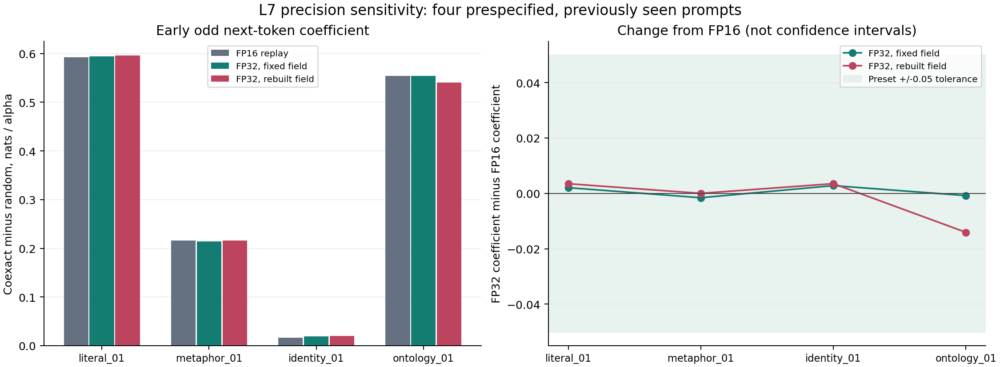
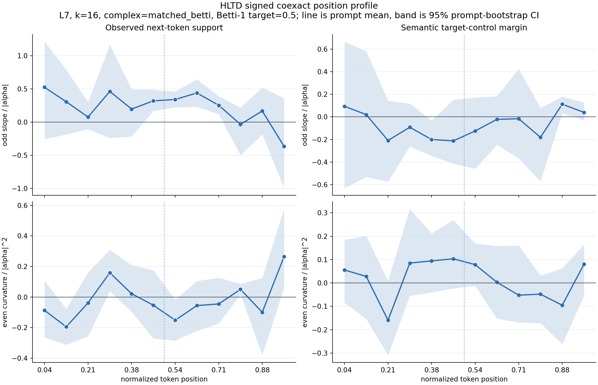

# Native-FP32 L7 Precision Pilot

## Scope

The [L7 signed position gate](hltd_signed_l7_position_gate.md) passed its frozen
20-prompt early-response endpoint in the recorded FP16 runtime. Its numerical
audit also found single-example versus batch-12 offsets. The relative
coexact-minus-random contrasts cancel their shared baseline offset, but that
does not test nonzero-dose precision sensitivity.

This follow-up asks whether those signed coefficients change materially when
the model is loaded from native FP32 weights. It is a **four-prompt numerical
pilot**, not another 20-prompt replication or a new semantic-control claim.

The first numbered prompt in each existing family was selected before native-
FP32 intervention results were produced: `literal_01`, `metaphor_01`,
`identity_01`, and `ontology_01`. They are previously seen texts; the FP16
results were already known. There are 128 interior token positions, eight
random seeds and six signed strengths, giving 12,288 rows per arm.

## What Changes

The local checkpoint stores F32 tensors. The host's local-model fast-loading
configuration chooses FP16 when neither `dtype` nor `torch_dtype` is specified.
The historical fast path and its configuration are left unchanged. This pilot
uses explicit, independent FP16 and FP32 loads of the same checkpoint.

All 148 trainable tensors are compared against the source checkpoint values.
The FP32 model must equal the F32 source; replay must equal its F32-to-F16 cast.
A half-precision model subsequently upcast to FP32 does not pass this check.
The dtype of every returned hidden state and the logits is checked as well.
Autocast and device fallback are not allowed.

| Arm | Model computation | Field, direction and norm scale |
| --- | --- | --- |
| `fp16_replay` | Explicit FP16 | Recomputed FP16 field |
| `fp32_fixed_field` | Native FP32 | Same FP16 field and nominal intervention vectors |
| `fp32_rebuilt_field` | Native FP32 | Recomputed from FP32 hidden states |

The first comparison isolates model precision while holding the nominal
intervention directions and strength scale fixed. It changes both stored-weight
rounding and forward arithmetic, not arithmetic alone. The second also includes
changes in PCA, neighbors, topology, field reconstruction and chart-relative
random directions. It is an end-to-end sensitivity check.

The historical numeric steering kernel is reused unchanged. Every nominal
batch of float32 intervention vectors is hashed before conversion to the model
dtype. Fixed-field FP32 must receive exactly the replay's sequence of nominal
delta bytes. The model-dtype addition can still round differently; that is part
of the precision comparison, not a hidden direction change.

## Frozen Conditions

The [protocol](data/hltd_precision_l7/protocol.json) was locally frozen before
nonzero FP32 intervention results. L7, k16, normalized PCA-32, centered field,
orthogonal matched-Betti 0.5, seeds 0-7 and alpha +/-0.25, +/-0.5, +/-1 remain
unchanged. Each arm uses an unhooked batch-12 baseline. Its twelve rows must be
exactly identical, and zero hooks must agree with the matched baseline within
0.0001 logits across all selected positions before any nonzero intervention.

FP16 replay runs first. Its saved steered probabilities and field scalars must
match the historical subset within 1e-8. Absolute deltas against the baseline
are intentionally not replay-identical because the new baseline is batch-matched.
The relative coexact-minus-random estimator is unchanged.

The sensitivity quantity is each prompt's equal mean of the four early-bin odd
next-token coefficients. All four bins must be available in every arm; no
missing estimates are imputed. Before running, the engineering tolerance was
set to **0.05 absolute coefficient change** relative to replay. Both FP32 arms
must stay within this bound for every prompt, and every arm's four early
coefficients must remain positive, to receive `PRECISION_STABLE_ON_PILOT`.

This tolerance is not a statistical equivalence margin for a population.
The existing 5,000-draw prompt-bootstrap profiles are descriptive with only four
seen prompts. Actual changes, coverage and failures are retained regardless of
the tolerance outcome. No larger sample or L8 run is selected from interim
results in this pilot.

## Results

The pilot completed on 2026-09-12 JST with **36,864 rows**, 12,288 per arm.
Its frozen decision is
[`PRECISION_STABLE_ON_PILOT`](data/hltd_precision_l7/precision_verdict.json).
All four early bins are present for each prompt in every arm.

### Early Direction-Dependent Response

These are coexact-minus-random odd next-token coefficients, in nats per alpha.
Each entry equally averages the prompt's four early bins; the final row equally
averages the four prompts. This compares the **same four texts** across arms,
not this subset's mean against the earlier 20-prompt mean.

| Prompt | FP16 replay | FP32 fixed field | FP32 rebuilt field |
| --- | ---: | ---: | ---: |
| `literal_01` | +0.592317 | +0.594373 | +0.595800 |
| `metaphor_01` | +0.215946 | +0.214373 | +0.215952 |
| `identity_01` | +0.016568 | +0.019369 | +0.020076 |
| `ontology_01` | +0.554448 | +0.553642 | +0.540386 |
| **Mean** | **+0.344820** | **+0.345439** | **+0.343054** |

All four prompt coefficients remain positive. The maximum absolute prompt
change is **0.002800** with the field fixed and **0.014062** with the field
rebuilt, both below the preset 0.05 engineering bound. The largest rebuilt
change is the decrease for `ontology_01`; `identity_01` remains weak in absolute
terms despite keeping its sign. The active coexact mask is unchanged at
**118/128** candidate token units in all three arms.



The right-hand shading is the preset sensitivity tolerance, not a confidence
interval. Exact values are in the
[paired comparison](data/hltd_precision_l7/early_precision_comparison.csv).

### Numerical Controls

| Maximum across 128 positions per dtype | FP16 | Native FP32 |
| --- | ---: | ---: |
| Zero hook versus matched-batch logits | 0 | 0 |
| Unhooked batch row spread | 0 | 0 |
| Single-example versus batch logits | 0.187500 | 0.000289917 |
| Absolute single/batch next-token log-probability offset | 0.063179 | 0.000037934 |

FP32 sharply reduces, but does not eliminate, the cross-batch discrepancy.
Both dtypes have exact matched-batch zero controls. This is why the matched
baseline remains part of the design even at higher precision. The
[zero-control receipt](data/hltd_precision_l7/zero_calibration.json) retains
every position rather than only the maxima.

The FP16 replay matches the historical subset's steered log probabilities to
1.78e-15. All **1,024 nominal delta batches** in fixed-field FP32 match the
FP16 replay's byte hashes, including random directions, strengths and ordering.
The [load audit](data/hltd_precision_l7/load_audit.json) verifies the source
values of all 148 trainable tensors, totaling 124,439,808 parameters, and tied
output embeddings. Hidden states and logits have the requested dtype.

Audit wording boundary: the frozen dtype policy says "bytes", while the in-run
weight check uses exact numerical equality (`np.array_equal`), which does not
distinguish signed zero. A
[supplementary fresh-load byte audit](data/hltd_precision_l7/supplemental_load_bytes_audit.json)
also matches all source tensor bytes for both dtypes, including signed zero.
It was performed after the run and is not a byte trace of the exact earlier
model objects. The intervention-vector byte trace, in contrast, was recorded
during the treatment run.

### Secondary Profiles



This figure is the **rebuilt-field FP32 arm, four seen prompts**. Bands are
descriptive 95% prompt-bootstrap intervals, not simultaneous intervals or a
new significance gate. Bin 11 has only three active prompts; the four early
bins have all four. Coverage tables are retained separately for every arm.

The rebuilt-field early semantic target-control odd coefficient is **-0.046917**
with descriptive interval **[-0.205868, +0.112035]**. The corresponding early
next-token even coefficient is **-0.040401**, interval **[-0.080412, +0.023722]**.
The pilot does not establish a positive early semantic-target effect or a
reliable even response. The lexical target sets are not learned identity or
affordance probes; fluency preservation is not established by this test.

## Interpretation and Next Gate

The narrow finding is that the early direction-dependent response survives
native FP32 computation on these four texts, whether the nominal intervention
field is fixed or rebuilt. Thus an FP16-only explanation is not sufficient for
this pilot. It does not establish hardware-independent equivalence, stability
for the remaining 16 prompts, independent prompt replication, or semantic
control. The field is still estimated transductively from each full
teacher-forced text; this is not online autoregressive field estimation.

The next precision gate should freeze a **full 20-prompt native-FP32** protocol
with the same signed position contract and matched baselines before looking at
L8. Keep fixed-field and rebuilt-field comparisons distinct and report every
prompt, including weak or failing cases. Require bytewise checks on the actual
in-run model objects in that new protocol. L8 remains a separately frozen
layer-extension test after this numerical boundary is resolved.

Subsequent follow-up: the [full20 native-FP32 gate](hltd_precision_l7_full_gate.md)
has now completed. Both precision arms pass the declared 0.05 sensitivity bound
on all 20 texts, with the largest rebuilt-field change retained explicitly.
The pilot's frozen inputs and data remain preserved as the earlier four-text
evidence; L8 is still a separate pending extension.

## Verification

An [independent raw audit](data/hltd_precision_l7/independent_raw_audit.json)
uses only standard-library CSV reduction: it directly subtracts steered
log probabilities, averages the eight seed pairs, fits per-token odd/even
coefficients, then averages tokens within prompt bins. All **188 coefficients
per arm, 564 total**, match the saved analysis within **3.34e-16**, without
using its estimator or saved baseline deltas.

Artifact tests independently recompute the prompt early means and sensitivity
decision, check complete calibration coverage and execution ordering, and
verify the compact evidence hashes. The two figures were visually inspected.
The [manifest](figures/hltd_precision_l7_manifest.json) binds the compact tables,
audits and figures to the larger local raw rows, cached fields and delta traces.
The full suite passes **174 tests**; targeted Ruff and `git diff --check` also
pass. All 26 precision-protocol file hashes and all 19 earlier L7 frozen file
hashes remain unchanged.

## Reproduction

```bash
python3 scripts/run_hltd_precision_gate.py \
  --protocol docs/data/hltd_precision_l7/protocol.json

python3 scripts/analyze_hltd_precision_gate.py \
  --protocol docs/data/hltd_precision_l7/protocol.json
```

Existing run or analysis directories are rejected. To repeat the experiment,
freeze a new protocol with a new output location. Historical frozen code and
data are not edited by this runner. Source hashes include the checkpoint,
prompt suite, target sets, numerical helpers, the new runner/analyzer and the
host loading configuration. The execution receipt binds the protocol hash to
the start/end status; failed runs keep an explicit failure receipt.

Large local artifacts include per-arm raw rows, nominal-delta traces, cached
hidden/PCA arrays, model-load and zero-control audits, replay checks and the
fixed-field equality check. The downstream learned-probe and closed-loop
questions remain separate, as does a full 20-prompt native-FP32 verification.
