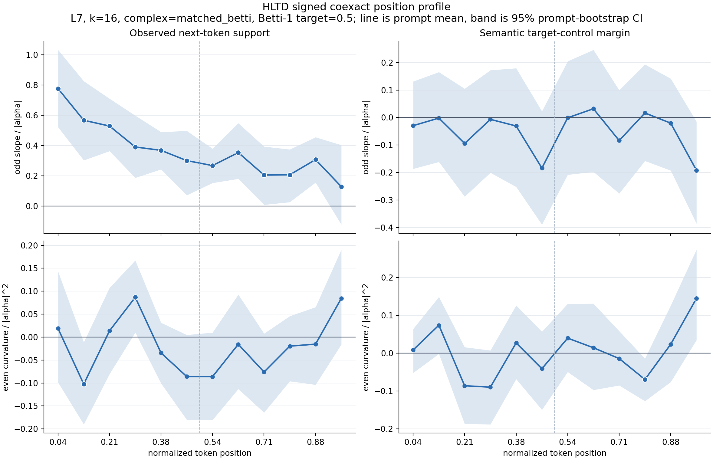
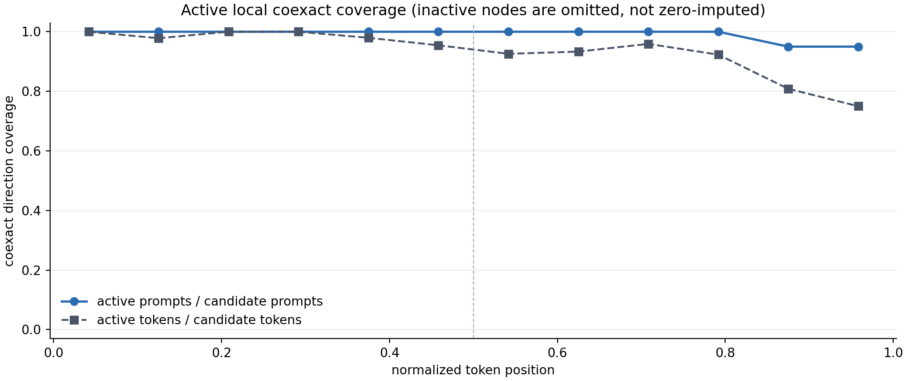

# HLTD Signed L7 Early-Position Gate

## Question and Evidence Boundary

Does the early-third direction-dependent coexact response also appear at L7
under the signed all-interior contract? L5 is discovery. This L7 endpoint was
locally frozen before the new treatment run, following the
[closed-loop phase audit](hltd_closed_loop_phase_audit.md).

The same 20 prompts are reused. This is within-sample layer generalization,
not independent prompt replication. Prior positive-only L7 and closed-loop
results were known when choosing the layer. The protocol is a timestamped local
record, not an externally registered or blinded study.

The field and PCA chart use the full teacher-forced text, including future
positions. Next-token support therefore measures a transductive activation
intervention, not held-out next-token prediction. Neither this endpoint nor a
lexical target-control margin establishes semantic control, identity collapse,
preserved fluency, or a harmonic concept ring.

## Frozen Contract

The authoritative [protocol](data/hltd_signed_l7_position/protocol.json) binds
the input text, model files, numerical code, token IDs, and exact launch arguments.
It was frozen before any treatment outputs from this run were generated or read.

- Local GPT-2 small, MPS, observed model dtype FP16.
- All 20 bundled prompts, 564 candidate interior token positions.
- Normalized hidden states, PCA 32, centered differences, L7, k16.
- Orthogonal matched-Betti complex, target Betti-1 fraction 0.5.
- Coexact and random tangent, seeds 0 through 7, alpha +/-0.25, +/-0.5, +/-1.
- Historical batch of 12 interventions; unchanged steering and analysis code.
- Twelve bins at `token_index / (token_count - 1)`.
- Seed mean, exact-token signed contrast, prompt-local bin mean, response fit,
  equal mean of four bin coefficients per prompt, then equal-weight prompt mean.
- 5,000 prompt-bootstrap draws, seed 1729, percentile 95% interval.

The **single primary endpoint** is early-bin 0-3 odd next-token response:
all 20 prompts must have estimates in all four bins, and the interval's lower
endpoint must be strictly positive. Otherwise the result is not supported, or
is insufficiently covered if any early prompt-bin lacks an estimate. No inactive
vectors are imputed, and prompts are not silently removed from the primary test.

Early-minus-late, even response, lexical semantic margin, and family/bin profiles
are secondary. Their intervals are not corrected for multiple comparisons.
An even-response interval containing zero does not establish equivalence.

## Numerical Calibration

The old model directory had moved. The recovered model's unsteered next-token
log probabilities matched all 564 historical L5 values exactly. This is an
empirical compatibility check, not complete historical model/runtime provenance:
the older run did not pin weight or runtime hashes, and baseline agreement alone
does not certify identical historical field construction.

The first calibration **failed**: a batch-12 zero intervention was compared
against a single-example forward pass. The first checked logit discrepancy was
0.0625, above the 0.0001 tolerance. That failure is retained in
[preflight_legacy_fp16.json](data/hltd_signed_l7_position/preflight_legacy_fp16.json).

The diagnostic separates batching from the hook. Across all 564 token positions,
zero hooks compared with an unhooked batch of the same size had **zero** logit
error; all twelve baseline rows also matched exactly. Cross-batch discrepancies
remained: maximum absolute logit error 0.25 and maximum observed-next-token
log-probability shift 0.10251262. See the
[full zero-control receipt](data/hltd_signed_l7_position/zero_batch_calibration.json).

For the primary and lexical-margin contrasts, the same scalar baseline is
subtracted from coexact and random:

```text
(logp_coexact - logp_single) - (logp_random - logp_single)
    = logp_coexact - logp_random
```

The shared offset cancels before both odd and even construction. An explicit
regression test checks this even when offsets vary by token, seed and sign.
The numerical core is retained to preserve the historical experiment contract.
Individual branch-versus-unsteered improvements and KL values do not inherit
this cancellation and must not be interpreted as clean zero-calibrated effects.

A one-token in-memory upcast diagnostic reduced batch/single discrepancies, but
it is **not** a full-precision replication: weights were upcast from loaded FP16,
not independently loaded and tested across nonzero interventions. Nonzero-dose
precision sensitivity remains open.

## Results

The run completed all 20 prompt/layer/k conditions in 755.3 seconds. Its 54,144
rows match the entire frozen grid, with 528/564 active coexact token units.
Early coverage is 80/80 prompt-bins and 183/184 candidate token units. The primary
verdict is **SUPPORTED_WITHIN_SAMPLE**:

| Endpoint | Mean coefficient | 95% prompt-bootstrap interval | Status |
| --- | ---: | ---: | --- |
| Early odd next-token response | +0.565892 | [+0.460341, +0.667825] | Frozen primary passes |
| Middle odd next-token response | +0.322766 | [+0.233721, +0.409028] | Secondary |
| Late odd next-token response | +0.211545 | [+0.106165, +0.316651] | Secondary; partial bins below |
| Early minus late, odd next-token | +0.354346 | [+0.221652, +0.486142] | Secondary; partial bins below |
| Early even next-token response | +0.004229 | [-0.039833, +0.046678] | Not an equivalence result |
| Early odd lexical semantic margin | -0.033118 | [-0.109832, +0.042632] | Positive semantic shift not supported |

Every prompt has a positive early odd coefficient. Descriptive family means are
literal +0.579520, metaphor +0.655914, identity +0.419183, and ontology +0.608950.
With five prompts per family, these are not family-ranking tests. The response
is not confined to the surreal/ontology families; literal text also carries it.



The next-token odd profile is strongest near the beginning, but not exclusive
to early positions. In contrast, all three phase-level odd lexical-margin
intervals include zero. This supports a direction-dependent observed-token
response, not a general semantic-circulation mechanism. The middle even
next-token estimate is -0.055550 [-0.096298, -0.008491], an uncorrected secondary
signal that also cautions against calling the full response purely odd.

### Late Coverage Sensitivity

Late bins 10 and 11 each have 19/20 active prompts. `literal_01` and `literal_02`
each contribute only three of four late-bin coefficients. The historical phase
helper averages available bins, so the reported 20-prompt late and early-minus-
late estimates retain them with three-bin late averages. The early primary is
unaffected and uses four bins for every prompt.

A separately labeled, **post-hoc** complete-late sensitivity uses the other
18 prompts: early-minus-late +0.347353 [+0.218109, +0.482432], with 5,000 paired
prompt resamples and seed 1729. It does not replace the frozen estimator or
change the primary verdict. The omitted prompts remain in the raw data,
coverage records and main summaries.



### Relation to L5 and Next Gate

L5's exploratory early estimate was +0.30051 [+0.17184, +0.43688]; the L7
estimate is descriptively larger. This is not a formal L7-minus-L5 test.
Strengths are scaled to each layer's own natural hidden-step norm, and exact
historical field/runtime equivalence has not been established. The defensible
new result is that the preselected early response also appears at L7 on this
same prompt set.

Before widening claims, the next bounded check should test nonzero interventions
with explicitly loaded FP32 weights and matched-batch baselines on a frozen
subset. Keep the FP16 result intact. L8 can then serve as a separately frozen
layer extension/falsification test. Prompt-disjoint evaluation and aligned
learned-probe/closed-loop contracts remain necessary for semantic claims.
Neither the FP32 sensitivity nor L8 has been run in this gate.

Subsequent follow-up: the [native-FP32 precision pilot](hltd_precision_l7_gate.md)
completed the frozen four-prompt check with a stable early response in both
fixed-field and rebuilt-field comparisons. That pilot does not replace this
20-prompt FP16 result. The subsequent
[full20 FP32 gate](hltd_precision_l7_full_gate.md) has also completed at its
declared sensitivity bound; L8 remains pending.

## Verification

An independent raw-CSV reduction directly subtracts steered log probabilities,
averages the eight seeds, fits each token's signed coefficient, and averages
those coefficients within bins. All **952** saved prompt-bin coefficients
match within 4.45e-16. This verifies that the common single/batch baseline offset
does not drive either saved contrast. The treatment run's unsteered values also
match historical L5 values at all 564 token units, with maximum error zero.

Separate artifact tests recompute all 16 phase bootstrap summaries from the
compact coefficients without importing the analysis helpers. They also check
the protocol-before-execution ordering, exact artifact hashes, complete zero-
control coverage and retained failed calibration. The three figures were
visually inspected. Numerical inference still refers to this recorded runtime;
these checks are not a nonzero-dose precision replication.

Compact evidence is in `docs/data/hltd_signed_l7_position/`, including the
[verdict](data/hltd_signed_l7_position/gate_verdict.json),
[raw audit](data/hltd_signed_l7_position/independent_raw_audit.json), and
[late sensitivity](data/hltd_signed_l7_position/complete_late_sensitivity.json).
The [artifact manifest](figures/hltd_signed_l7_position_manifest.json) binds
16 compact data files, three figures and 37 large/local source receipts.

## Reproduction and Receipts

The complete model path and launch argument array are in the protocol. The
model is local-only; no replacement model is downloaded. Raw runs live in:

```text
spiral_out_hltd_matched_betti_signed_position_l7_full20_s8_20260911/
```

The execution receipt records the protocol hash, start/end times and exit code.
The receipt helpers require Python 3.11+; this run used Python 3.12.6.
Evaluate only after completion, against the frozen files:

```bash
python3 scripts/evaluate_hltd_signed_layer_gate.py \
  --protocol docs/data/hltd_signed_l7_position/protocol.json \
  --summary spiral_out_hltd_matched_betti_signed_position_l7_full20_s8_20260911/summary.csv \
  --output-root spiral_out_hltd_matched_betti_signed_position_l7_full20_s8_20260911/position
```

The evaluator refuses an existing output directory or changed frozen inputs.
It validates the exact prompt/token/component/sign/seed grid before filtering
inactive vectors, checks shared baselines and activity consistency, then applies
the frozen primary rule. A later replication should freeze a new protocol and
use a new output directory, not overwrite this record.
