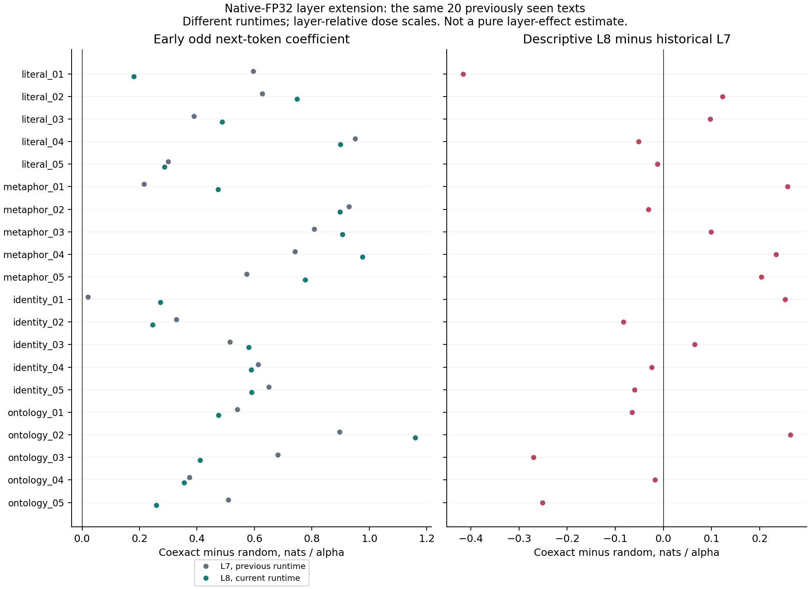
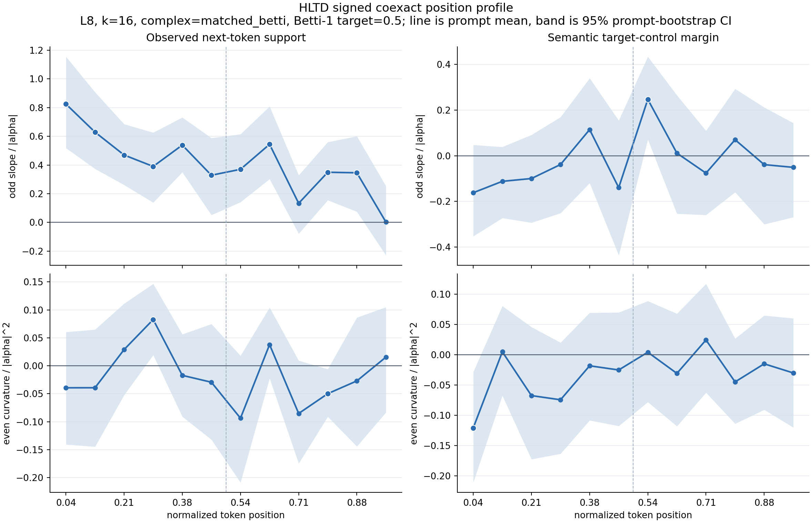

# Native-FP32 L8 Signed Early-Response Gate

## Question

Does the early signed coexact-minus-random next-token response observed at L7
also meet the **same fixed endpoint at L8**, with native-FP32 rebuilt fields?
This is a same-text layer-extension test, not independent prompt replication.
L8 was chosen after earlier exploratory layer results and the L7 precision
gate. It is not a blinded layer selection.

## Frozen Contract

The [initial protocol](data/hltd_signed_l8_position/protocol.json) was frozen
before the new L7 bridge or L8 doses. An
[input-recovery continuation](data/hltd_signed_l8_position/protocol_continuation.json)
was frozen after the bridge measurements but before any L8 treatment.
The continuation changes the missing reference-input route and output
directory, not the experiment, prompt selection, threshold, or endpoint.

| Condition | Value |
| --- | --- |
| Model | Local GPT-2 small, native FP32 source weights and rebuilt field |
| Geometry | L8, k16, normalized PCA-32, centered field, orthogonal matched-Betti 0.5 |
| Doses | Coexact and random tangent, alpha +/-0.25, +/-0.5, +/-1 |
| Replicates | 20 known texts, all 564 interior positions, eight random seeds |
| Raw L8 size | 54,144 rows; 4,512 nominal intervention batches |
| Baseline | Unhooked batch-12, matched to the treatment batch |
| Primary | Odd next-token coefficient, four early bins, equal prompt weights |
| Inference | 5,000 prompt-bootstrap draws, seed 1729, percentile 95% interval |

The primary is supported only with complete **80/80 early prompt/bin**
coverage and a strictly positive lower interval endpoint. Otherwise retain
`NOT_SUPPORTED` or `INSUFFICIENT_COVERAGE`. There is no L8 requirement that
every individual prompt be positive. No imputation, prompt removal, or
post-result bin selection is allowed.

All 148 actual in-run trainable tensors must match the source F32 bytes,
including signed zero. FP16-upcast weights, autocast, and device fallback are
forbidden. The runner requires MPS and SDPA, verifies all captured forward
activations/logits as FP32, and requires every stage's zero-control checks
before any nonzero doses in that stage. Zero-hook error must be <=1e-4;
unhooked baseline rows must be identical.

## Environment and Recovery

The old model directory no longer contained `model.safetensors`. A cached
local snapshot contains the exact original checkpoint, SHA-256
`248dfc3911869ec493c76e65bf2fcf7f615828b0254c12b473182f0f81d3a707`.
No download, model conversion, host configuration edit, or FP16 fast-path
change was needed. The 30 other files in the old 31-file freeze were unchanged.
Transformers is now 4.57.6, compared with the previous recorded 5.13.0;
PyTorch remains 2.12.1. The new runtime and relevant source files are frozen.

Before L8, the protocol requires a L7 runtime bridge on the original four
FP32 pilot texts plus `literal_03`, the previously identified reconstruction
sensitivity case. It uses all 154 interior positions, 14,784 rows, and the
same doses/seeds. All five early coefficients must remain positive, change
by at most 0.05 absolute, and keep exactly the same full-interior activity
masks. This is an engineering continuity gate on five texts, not full-suite
runtime equivalence or a population-equivalence test.

The first attempt measured and independently audited this bridge, then
stopped because the historical aggregate `fp32_rebuilt_field/summary.csv`
was missing. Its freezer had incorrectly skipped a missing required input.
The failed protocol, source, execution receipt, raw data, and logs remain
unchanged. No L8 treatment occurred in that attempt.

The old per-prompt CSVs were still present: all 20 matched the old manifest's
hashes. The continuation strictly verifies the five required shards, restores
their family metadata from the frozen suite, and independently recomputes
their coefficients against the old compact tables. This recovers numerical
row evidence, not the exact bytes of the deleted aggregate. The new bridge
measurements are reused, not repeated. A failed experimental bridge would
still stop L8; this continuation only accepts the specific missing-input error.

## Results

The run completed on 2026-09-27 JST. The frozen decision is
[`SUPPORTED_WITHIN_SAMPLE`](data/hltd_signed_l8_position/gate_verdict.json).
The complete L8 raw grid contains **54,144 rows**, with **534/564 active
coexact positions** and complete **80/80 early prompt/bin** coverage.

| Early odd next-token endpoint | Result |
| --- | ---: |
| Equal-prompt mean coefficient, nats / alpha | +0.578456 |
| 95% prompt-bootstrap interval | [+0.459113, +0.702846] |
| Positive prompt means | 20/20 |
| Previous native-FP32 L7 mean, descriptive reference | +0.562878 |

The same-text early response is therefore not confined to L7. This does not
show that L8 is stronger, that either layer is optimal, or that the result
generalizes to new texts.

### Runtime Bridge

The L7 bridge passed. All five early coefficients matched the saved
native-FP32 values, with maximum change **0** and **zero activity changes**.
The stricter descriptive replay check also found zero differences in the
saved steered next-token/target/control log probabilities, activity flags,
natural step norms, chart norms and hidden-direction norms over all 14,784
rows. These checks concern the five bridge texts, not all 20 treatment texts.
The bridge retained 143/154 active positions.

### Layer Comparison



The average L8-minus-historical-L7 change is only **+0.015578**, but this hides
substantial prompt differences: nine increase and eleven decrease.
`literal_01` changes from +0.595800 to +0.179560 (-0.416240), while
`ontology_02` changes from +0.895948 to +1.159982 (+0.264034).
`literal_03` remains included: +0.390026 at L7 and +0.487337 at L8.
These are descriptive, prompt-specific contrasts, not separate significant
effects or a layer-only causal estimate.

### Position and Semantic Boundary



The next-token odd coefficient decreases descriptively from **+0.578456**
early, to **+0.451009** middle, to **+0.207431** late. The exploratory
early-minus-late contrast is +0.371025, unadjusted interval
[+0.223033, +0.527918]. The middle region has a coverage caveat: bin 5 has
19 active prompts; all other bins have 20. Phase summaries can average the
available middle bins, but the early primary requires all four for everyone.

| Secondary early coefficient | Mean | Unadjusted 95% interval |
| --- | ---: | --- |
| Next-token even | +0.008296 | [-0.034007, +0.052730] |
| Lexical semantic margin, odd | -0.103024 | [-0.182267, -0.027380] |
| Lexical semantic margin, even | -0.064299 | [-0.115614, -0.015643] |

The semantic target/control contrast points **negative**, not positive, in
the early region. This is not evidence for desired semantic steering or
ontology collapse. These secondary intervals are not multiplicity-adjusted;
they describe this chosen lexical probe and must not replace the primary
endpoint. Token support and semantic-target alignment remain separate.

### Numerical and Independent Checks

All 564 L8 zero-hook checks have **zero** error against matched-batch logits,
with zero row spread. Single-example versus batch offsets are still present:
maximum logit difference 0.000328064 and absolute next-token log-probability
offset 0.000043861. Matched baselines remain necessary.

The [standard-library raw audit](data/hltd_signed_l8_position/stdlib_raw_audit.json),
also run with `python3 -S`, reconstructs **236 bridge + 956 L8 = 1,192**
coefficients directly from steered probabilities. Maximum error is
3.34e-16. The recovered historical bridge's 236 coefficients independently
match its compact reference within 1.31e-15.

Artifact tests separately reconstruct all **32** bridge/L8 phase bootstrap
summaries without production analysis helpers, and verify the endpoint,
freeze chronology, exact zero-control grids and source receipts. The
[manifest](figures/hltd_signed_l8_position_manifest.json) binds compact data,
both inspected figures, both attempts, launch logs, raw CSVs and field caches.
No failed attempt or previous frozen source was overwritten.
The full suite passes **195 tests**. Targeted Ruff checks (with the existing
script import-path convention excluded as E402), compilation, and
`git diff --check` pass. All 98 continuation input receipts still match.

## Interpretation Boundary

The PCA chart is fitted to all layers and positions of each **full
teacher-forced text**, including future tokens. The direction field is
therefore offline and text-conditioned. A causal activation intervention in
the forward pass does not make this an online-available predictive field.

The endpoint is a signed response of the observed next token relative to a
random tangent control. It is not an absolute fluency improvement, an identity
or affordance-control result, or evidence for concept rings. The semantic
margin is a lexical target/control-set probe and remains secondary.

L8 minus historical L7 is descriptive only. The runtime changed, the bridge
covers only five texts, and alpha scales by each layer's own natural hidden
step norm. This contrast does not isolate a layer-only causal effect or
hold absolute perturbation magnitude fixed. Position bands are pointwise,
not simultaneous inference; seeds and tokens are not independent prompts.

## Next Gate

The next useful test is **previously unused prompts with L7 and L8 run in
one frozen runtime**, retaining the current early endpoint and reporting the
lexical semantic outcome separately. Freeze prompt selection and both
layer-specific dose normalization and an optional common-norm comparison
before observing responses. Do not keep scanning layers on the same 20 texts
and call that independent replication. No such follow-up is run here.

## Reproduction

```bash
python3 scripts/continue_hltd_l8_gate.py \
  --protocol docs/data/hltd_signed_l8_position/protocol_continuation.json

python3 scripts/analyze_hltd_l8_gate.py \
  --protocol docs/data/hltd_signed_l8_position/protocol_continuation.json
```

The commands describe the recorded run. Existing output directories are
rejected. A new experiment requires a separate prospective freeze; never
overwrite these attempts or silently retry a failed experimental gate.
