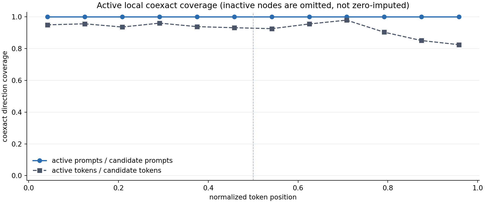
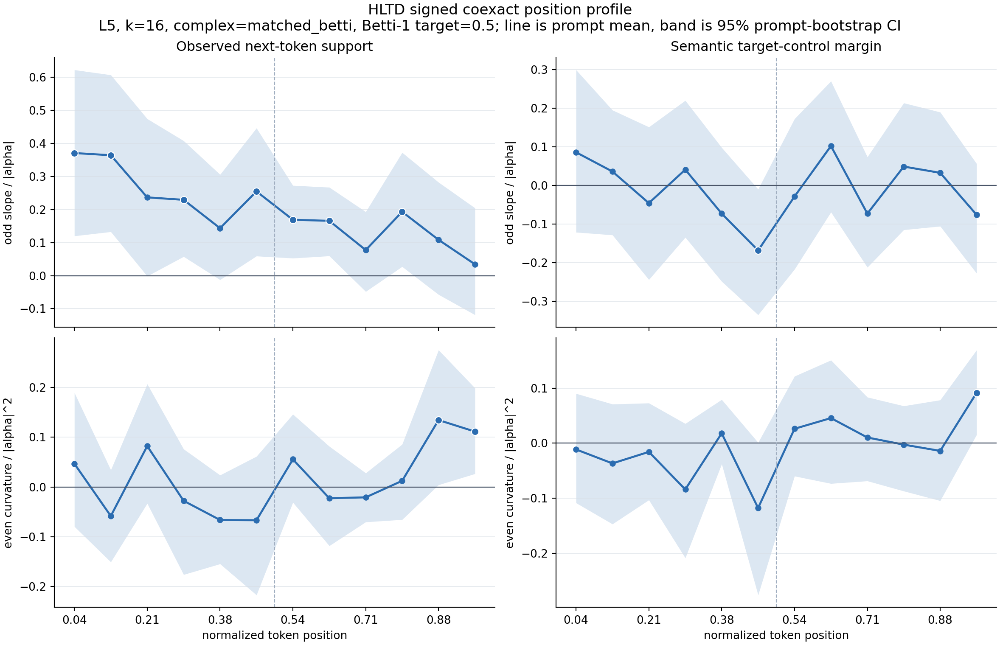
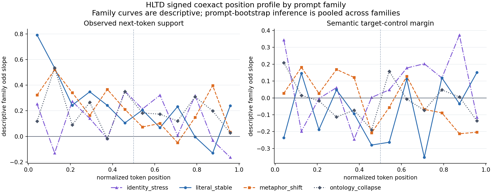

# HLTD Signed All-Interior Position Gate

## Question

The signed middle-node gate found a direction-dependent coexact advantage over
random tangents for support of the observed next token. This follow-up asks
whether that effect is confined to the selected middle node or forms a broader
position profile.

The gate keeps the same matched-topology and signed-response contract, but
intervenes at every centered interior token. For each exact prompt/token pair,
it computes:

```text
gap(alpha) = coexact(alpha) - seed-matched random_tangent(alpha)
odd(a)     = (gap(+a) - gap(-a)) / 2
even(a)    = (gap(+a) + gap(-a)) / 2
```

The aggregation order is fixed:

```text
random-seed mean
  -> exact-token +alpha/-alpha pair
  -> prompt-local position-bin mean
  -> prompt response coefficient
  -> prompt bootstrap
```

Tokens and random seeds are repeated measurements. The prompt remains the
inference unit.

## Fixed Contract

- model: local GPT-2 small
- prompts: all 20 bundled prompts, five per family
- chart: normalized hidden states, PCA 32
- vector field: centered differences
- layer: L5
- graph: k=16
- complex: orthogonal matched-Betti decomposition
- target Betti-1 fraction: 0.5
- selected positions: all centered interior nodes
- branch: coexact
- null: eight random-tangent seeds, 0 through 7
- random reference: `max_full_branch_node_speed`
- strengths: alpha -1.0, -0.5, -0.25, 0.25, 0.5, and 1.0
- position chart: 12 normalized token-position bins
- uncertainty: 5,000 prompt bootstrap draws, seed 1729

Every active branch and random direction is normalized to the same prompt-level
natural hidden-step norm at a given absolute alpha. Inactive local coexact
vectors are omitted from effect estimates, retained in coverage denominators,
and never zero-imputed.

## Analysis Provenance

The 12-bin all-interior localization and signed odd/even contract were fixed
before the run. The equal-third early/middle/late summaries and the linear
position trend were added after inspecting the 12-bin result. They are
explicitly exploratory compression checks, not pre-registered endpoints or an
independent replication. Per-bin intervals are also not
multiple-comparison-corrected.

## Run

```bash
python3 scripts/run_hltd_steering_fast_suite.py \
  --model-path /Users/ryospiralarchitect/SpiralReality/model/gpt2 \
  --output-root spiral_out_hltd_matched_betti_signed_position_full20_s8 \
  --layers 5 \
  --k 16 \
  --complex-mode matched_betti \
  --target-betti-1-fraction 0.5 \
  --steering-components coexact random_tangent \
  --token-selectors all_interior \
  --alphas -1.0 -0.5 -0.25 0.25 0.5 1.0 \
  --seeds 0 1 2 3 4 5 6 7 \
  --target-set-file data/hltd_semantic_targets.json \
  --device mps

python3 scripts/plot_hltd_signed_position_gate.py \
  --summary spiral_out_hltd_matched_betti_signed_position_full20_s8/summary.csv \
  --output-root spiral_out_hltd_matched_betti_signed_position_full20_s8/position \
  --bins 12 \
  --expected-prompts 20 \
  --expected-null-seeds 8 \
  --expected-alpha-magnitudes 3
```

The model run completed 20 prompt/layer/k runs in 454.3 seconds.

## Data Contract And Coverage

The raw run has 54,144 rows from 564 candidate interior prompt/token units.
The strict analyzer produced:

- 50,208 active seed-matched branch-minus-random metric gaps
- 6,276 seed-collapsed exact-token signed contrasts
- 2,880 prompt-bin signed contrasts across alpha magnitudes
- 960 prompt-bin response coefficients
- 48 pooled position estimates: 12 bins x 2 parities x 2 readouts

The realized Betti-1 fraction is 0.5000-0.5022 (mean 0.5013). Mean Hodge
energy is exact 0.1056, coexact 0.5203, and open-cycle harmonic residual
0.3741.

Coexact is active at 523/564 candidate token units (92.7%). All 20 prompts
retain at least one active coexact token in every bin. Token coverage ranges
from 98.0% in bin 8 to 82.5% in bin 11.



The analyzer fails before writing plots if a token lacks either alpha sign or
if positive and negative rows do not contain the same random-seed set. The
explicit expected-count preflight also rejects a truncated prompt suite or a
globally shortened seed/strength schedule.

## Position Profile



The primary odd next-token coefficient is positive across the sequence but is
front-loaded. The equal-third table is a post-hoc summary of the fixed bin
profile:

| normalized phase | prompts | odd next-token slope | 95% prompt CI | positive prompts |
| --- | ---: | ---: | ---: | ---: |
| early, 0.00-0.33 | 20 | +0.30051 | [+0.17184, +0.43688] | 17/20 |
| middle, 0.33-0.67 | 20 | +0.18344 | [+0.12322, +0.24241] | 19/20 |
| late, 0.67-1.00 | 20 | +0.10344 | [+0.03069, +0.17756] | 15/20 |
| early minus late | 20 | +0.19707 | [+0.04367, +0.34178] | 14/20 |

A compact exploratory fit reaches the same read. A linear
coefficient-versus-normalized-position slope is fit within every prompt and
then bootstrapped across prompts:

| response | mean position slope | 95% prompt CI | prompts with negative slope |
| --- | ---: | ---: | ---: |
| odd next-token | -0.29756 | [-0.49965, -0.08846] | 14/20 |
| even next-token | +0.09414 | [-0.00851, +0.20554] | 8/20 |
| odd semantic margin | -0.04430 | [-0.25766, +0.15158] | 11/20 |
| even semantic margin | +0.08921 | [+0.00561, +0.17786] | 7/20 |

The linear fit is a post-hoc descriptive summary, not a claim that the profile
is actually linear.

At the individual-bin level, odd next-token intervals exclude zero in bins
0, 1, 3, 5, 6, 7, and 9. These cells are dependent and the scan is not
multiple-comparison corrected. The broad phase estimates and paired
early-minus-late contrast are the more stable read.

## Odd Versus Even

The direction-dependent and sign-symmetric profiles separate by position:

- odd next-token response is strongest early and remains positive in all
  three broad phases.
- even next-token response is near zero in the early and middle phases, then
  becomes positive late: +0.05941, 95% CI [+0.01752, +0.10400].
- individual even next-token intervals exclude zero only in bins 10 and 11.
- semantic even response has an isolated positive interval in bin 11 and a
  positive exploratory position trend, but its broad late-phase interval still
  crosses zero.

This is consistent with a directional transport advantage that weakens toward
the endpoint while sign-symmetric perturbation sensitivity grows. It is not a
calibrated mechanistic separation yet, because the late even result was found
inside a position scan.

## Semantic-Margin Localization

The coarse lexical semantic target-control margin does not show a broad signed
position effect:

| normalized phase | odd semantic slope | 95% prompt CI |
| --- | ---: | ---: |
| early | +0.02956 | [-0.06356, +0.12342] |
| middle | -0.04168 | [-0.12014, +0.03663] |
| late | -0.01664 | [-0.10368, +0.06873] |

Only bin 5 has an odd interval below zero: -0.16822, 95% CI
[-0.33513, -0.00955]. The earlier middle-node semantic slope of -0.31921 is
therefore better read as a selected-center localization than a sequence-wide
coexact property. Neighboring interior positions dilute it.

This sharpens the interpretation: coexact orientation predicts the observed
next token broadly, but it is not consistently directed toward the current
family-level lexical target set.

## Family Heterogeneity



Descriptive odd next-token phase means remain positive in every family and
phase, but the shape differs:

| family | early | middle | late | mean position trend |
| --- | ---: | ---: | ---: | ---: |
| literal stable | +0.4788 | +0.1553 | +0.0846 | -0.6191 |
| metaphor shift | +0.3372 | +0.1883 | +0.1324 | -0.3211 |
| identity stress | +0.1341 | +0.2180 | +0.0328 | -0.1324 |
| ontology collapse | +0.2520 | +0.1721 | +0.1639 | -0.1176 |

Each family contains only five prompts, so these curves are supplementary.
They show that the pooled result is not confined to one prompt family, while
also rejecting a universal monotone shape: identity-stress is strongest in
the middle phase.

## Exact Replay Check

The previous signed middle-only run is an exact subset of this all-interior
run. Joining its 1,920 coexact/random rows to the corresponding all-interior
token rows gives:

- 1,920/1,920 exact condition matches
- maximum absolute difference in `component_active`: 0
- maximum absolute difference in `delta_norm`: 0
- maximum absolute difference in KL: 0
- maximum absolute difference in next-token delta: 0
- maximum absolute difference in semantic-margin delta: 0

The 20 middle-selected tokens split evenly between bins 5 and 6. This connects
the new profile to the earlier +0.32780 coexact middle-node next-token slope
without changing the intervention implementation.

## Decision

This gate passes the position-localization question under the fixed L5/k16
matched-Betti contract:

> The positive coexact orientation has a prompt-level advantage over
> norm-matched random tangents for support of the observed next token across
> early, middle, and late interior positions, with an observed early-phase
> advantage and weakening toward the endpoint.

The result is broader than a single selected middle node and narrower than a
general semantic-circulation claim. It does not show broad target-directed
semantic movement, preserved fluency under autoregressive rollout, or a
harmonic concept ring.

The next robustness gate should freeze early/middle/late position contrasts
and repeat them across layers, especially L5/L7/L8, because the earlier
positive-only all-interior sweep peaked at L7. After layer-position
replication, signed learned-probe and closed-loop gates can test whether the
oriented predictive effect corresponds to ontology/affordance drift rather
than only immediate observed-token support.

## Artifacts

- `position/summary_seed_matched_position_gaps.csv`
- `position/summary_seed_collapsed_position_gaps.csv`
- `position/summary_token_signed_contrasts.csv`
- `position/summary_prompt_bin_signed_contrasts.csv`
- `position/summary_prompt_bin_response_coefficients.csv`
- `position/summary_position_response_bootstrap.csv`
- `position/summary_prompt_position_phases.csv`
- `position/summary_position_phase_bootstrap.csv`
- `position/summary_prompt_position_trends.csv`
- `position/summary_position_trend_bootstrap.csv`
- `position/summary_family_position_response.csv`
- `position/summary_position_coverage.csv`
- `position/summary_signed_position_report.md`
- `position/plots/signed_coexact_position_profile.png`
- `position/plots/signed_coexact_family_position_profile.png`
- `position/plots/signed_coexact_position_coverage.png`
- `data/hltd_signed_position/`: tracked prompt coefficients and compact
  aggregate CSVs used by this note and the figures
- `figures/hltd_signed_position_manifest.json`: hashes and row counts linking
  the ignored local source artifacts to the tracked figures
